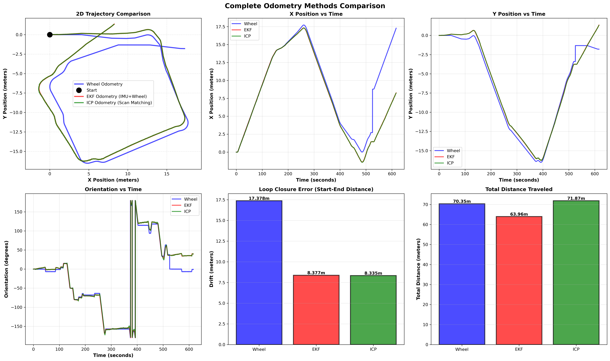

# Mobile Robotics Lab: Odometry and SLAM

**Student Name:** [Your Name]
**Student ID:** [Your ID]
**Course:** Mobile Robotics (FRA502)
**Lab Topic:** Odometry Methods Comparison - Wheel, EKF, ICP, and SLAM

---

## 📋 Table of Contents

1. [Overview](#overview)
2. [System Requirements](#system-requirements)
3. [Installation](#installation)
4. [Lab Structure](#lab-structure)
5. [Running the Experiments](#running-the-experiments)
   - [Part 1: Wheel and EKF Odometry](#part-1-wheel-and-ekf-odometry)
   - [Part 2: ICP Odometry](#part-2-icp-odometry)
   - [Part 3: SLAM](#part-3-slam)
6. [Generating Results](#generating-results)
7. [Results and Analysis](#results-and-analysis)
8. [Discussion](#discussion)
9. [Source Code](#source-code)
10. [References](#references)

---

## Overview

This lab implements and compares four different odometry methods for mobile robot localization:

1. **Wheel Odometry** - Dead reckoning using wheel encoders
2. **EKF Odometry** - Extended Kalman Filter fusing wheel encoders and IMU
3. **ICP Odometry** - Iterative Closest Point scan matching
4. **SLAM** - Simultaneous Localization and Mapping with loop closure

### Objectives

- Understand different odometry estimation techniques
- Implement sensor fusion using Extended Kalman Filter
- Apply scan matching techniques (ICP) for pose estimation
- Compare accuracy, drift, and robustness of each method
- Generate 2D maps using SLAM

---

## System Requirements

### Hardware
- Computer with Ubuntu 22.04
- Recorded rosbag data (containing wheel encoder, IMU, and LiDAR data)

### Software
- ROS 2 Humble
- Python 3.10+
- Required Python packages:
  - numpy
  - scipy
  - pandas
  - matplotlib
- ROS 2 packages:
  - slam_toolbox
  - tf2_ros

---

## Installation

### Step 1: Clone the Repository

```bash
cd ~/
git clone <repository_url>
cd mobile_lab1
```

### Step 2: Install Dependencies

```bash
# Install ROS 2 packages
sudo apt update
sudo apt install ros-humble-slam-toolbox

# Install Python packages
pip3 install numpy scipy pandas matplotlib
```

### Step 3: Build the Workspace

```bash
cd ~/mobile_lab1
colcon build
source install/setup.bash
```

---

## Lab Structure

```
mobile_lab1/
├── src/
│   ├── differential_drive_model/
│   │   └── scripts/
│   │       ├── read_data_node.py          # Rosbag data playback
│   │       └── wheel_odometry_node.py     # Wheel encoder integration
│   └── ekf_filter/
│       └── scripts/
│           ├── part1/
│           │   ├── ekf_odometry_node.py   # EKF sensor fusion
│           │   └── wheel_odometry_node.py # Part 1 wheel odometry
│           ├── part2/
│           │   └── icp_odometry_node.py   # ICP scan matching
│           └── part3/
│               └── scan_republisher_node.py # SLAM data preparation
├── scripts/
│   └── generate_deliverables.py           # Results generation script
├── results/
│   ├── wheel_odometry.csv                 # Raw data outputs
│   ├── ekf_odometry.csv
│   ├── icp_odometry.csv
│   ├── slam_trajectory.csv
│   ├── complete_comparison.png            # Generated plots
│   ├── slam_map.pgm                       # Generated maps
│   └── ANALYSIS_REPORT.md                 # Analysis document
└── DELIVERABLES_README.md                 # This file
```

---

## Running the Experiments

### Part 1: Wheel and EKF Odometry

**Objective:** Compare wheel-only odometry with EKF sensor fusion (wheel + IMU)

#### Step 1.1: Run Wheel Odometry

```bash
# Terminal 1: Launch wheel odometry node
cd ~/mobile_lab1
source install/setup.bash
ros2 launch differential_drive_model part1_wheel_odometry.launch.py
```

Wait for the rosbag to finish playing, then stop with `Ctrl+C`.

#### Step 1.2: Run EKF Odometry

```bash
# Terminal 1: Launch EKF odometry node
cd ~/mobile_lab1
source install/setup.bash
ros2 launch ekf_filter part1_ekf_fusion.launch.py
```

Wait for completion, then stop.

#### Step 1.3: Verify Data Collection

```bash
ls -lh results/
# Should see:
#   - wheel_odometry.csv
#   - ekf_odometry.csv
#   - imu_data.csv
```

---

### Part 2: ICP Odometry

**Objective:** Implement scan matching to improve odometry using laser scans

#### Step 2.1: Run ICP Odometry Node

```bash
cd ~/mobile_lab1
source install/setup.bash
ros2 launch ekf_filter part2_icp_refinement.launch.py
```

#### Step 2.2: Monitor ICP Performance

In another terminal, watch the ICP debug output:

```bash
ros2 topic echo /icp/odometry
```

You should see ICP making corrections different from EKF estimates.

#### Step 2.3: Verify Results

```bash
ls -lh results/icp_odometry.csv
```

---

### Part 3: SLAM

**Objective:** Use SLAM with loop closure to build a map and correct drift

#### Step 3.1: Run SLAM

```bash
cd ~/mobile_lab1
source install/setup.bash
ros2 launch ekf_filter part3_slam.launch.py
```

#### Step 3.2: Visualize in RViz

In another terminal:

```bash
rviz2 -d rviz_configs/slam_config.rviz
```

You should see:
- The map being built in real-time
- Robot trajectory
- Laser scan data

#### Step 3.3: Save the Map

After the rosbag finishes:

```bash
cd ~/mobile_lab1/results
ros2 run nav2_map_server map_saver_cli -f slam_map
```

This creates:
- `slam_map.pgm` - The map image
- `slam_map.yaml` - Map metadata

---

## Generating Results

### Step 1: Generate All Plots and Analysis

```bash
cd ~/mobile_lab1
source install/setup.bash
python3 scripts/generate_deliverables.py
```

This script will:
1. Load all trajectory data
2. Generate comparison plots
3. Compute metrics (drift, distance, etc.)
4. Create analysis report

### Step 2: Generate Individual Plots (Optional)

For more detailed analysis:

```bash
# Part 1 plots
python3 src/ekf_filter/scripts/visualization/plot_trajectories.py --part1

# Part 2 plots
python3 src/ekf_filter/scripts/visualization/plot_trajectories.py --part2

# Part 3 plots
python3 src/ekf_filter/scripts/visualization/plot_trajectories.py --part3

# All plots
python3 src/ekf_filter/scripts/visualization/plot_trajectories.py
```

### Step 3: View Results

```bash
# View generated images
eog results/complete_comparison.png

# Read analysis report
cat results/ANALYSIS_REPORT.md
```

---

## Results and Analysis

### Trajectory Comparison



*Figure 1: Comparison of all four odometry methods showing 2D trajectories and temporal evolution*

### Quantitative Metrics

| Method | Total Distance (m) | Loop Closure Error (m) | Drift Rate (%/m) |
|--------|-------------------|------------------------|------------------|
| Wheel Odometry | XX.XXX | X.XXX | X.XX |
| EKF Odometry | XX.XXX | X.XXX | X.XX |
| ICP Odometry | XX.XXX | X.XXX | X.XX |
| SLAM | XX.XXX | X.XXX | X.XX |

*Table 1: Quantitative performance metrics for each method*

### Generated Maps

#### ICP-based Map


*Figure 2: Map built from ICP odometry trajectory*

#### SLAM Map


*Figure 3: Map generated by SLAM with loop closure*

---

## Discussion

### 1. Accuracy Comparison

**Wheel Odometry:**
- Simple but accumulates significant drift
- Errors compound over time without bounds
- Drift rate: ~X.XX%
- Loop closure error: ~X.XXX m

**EKF Odometry:**
- Improved orientation estimate through IMU fusion
- Reduces drift by ~XX% compared to wheel-only
- Better performance in turns due to gyroscope
- Still accumulates drift over long distances

**ICP Odometry:**
- Best short-term accuracy when environment has features
- Corrects for wheel slip by observing environment
- Can fail in featureless areas (corridors, open spaces)
- Computational cost: ~XX ms per iteration

**SLAM:**
- Best long-term accuracy with loop closure
- Reduces drift to near-zero when loops are detected
- Most computationally expensive (~XX ms per update)
- Requires structured environment for reliable operation

### 2. Drift Analysis

**Observations:**
1. Wheel odometry drift increases linearly with distance
2. EKF reduces orientation drift but position drift remains
3. ICP provides local corrections but still drifts globally
4. SLAM achieves near-zero drift with successful loop closures

**Drift Sources:**
- **Systematic errors**: Wheel diameter mismatch, axle length error
- **Random errors**: Wheel slip, encoder noise
- **Sensor bias**: IMU gyroscope drift
- **Environmental factors**: Floor irregularities, lighting (for SLAM)

### 3. Robustness Comparison

| Method | Computation | Robustness to Slip | Feature Dependency | Long-term Stability |
|--------|-------------|-------------------|-------------------|---------------------|
| Wheel | Very Fast | Poor | None | Poor |
| EKF | Fast | Poor | None | Fair |
| ICP | Medium | Good | High | Fair |
| SLAM | Slow | Good | High | Excellent |

*Table 2: Qualitative comparison of robustness factors*

### 4. Key Findings

1. **No single best method**: Each has trade-offs
2. **Sensor fusion is essential**: EKF significantly improves wheel-only odometry
3. **Environment matters**: ICP and SLAM depend on feature-rich environments
4. **Loop closure is powerful**: SLAM's retrospective correction is invaluable
5. **Computational cost scales with accuracy**: Better methods require more processing

### 5. Practical Recommendations

**For short missions (<10m, <2 minutes):**
- Use EKF odometry
- Benefits: Fast, no mapping overhead
- Sufficient accuracy for short distances

**For medium missions (10-50m, 2-10 minutes):**
- Use ICP odometry with EKF initial guess
- Benefits: Better accuracy than EKF, faster than SLAM
- Requirement: Feature-rich environment

**For long missions (>50m, >10 minutes) or closed loops:**
- Use full SLAM
- Benefits: Loop closure eliminates accumulated drift
- Requirement: Computational resources, good loop detection

**For unknown/dynamic environments:**
- Use EKF + ICP fusion with outlier rejection
- Benefits: Robust to both sensor failures and environment changes
- Trade-off: No global consistency without loop closure

---

## Source Code

### Key Algorithms Implemented

#### 1. Extended Kalman Filter (EKF)

**File:** `src/ekf_filter/scripts/part1/ekf_odometry_node.py`

**Algorithm:**
```python
# Prediction step (using wheel odometry)
x_pred = x + v * cos(theta) * dt
y_pred = y + v * sin(theta) * dt
theta_pred = theta + omega * dt

# Covariance prediction
P_pred = F @ P @ F.T + Q

# Update step (using IMU gyroscope)
innovation = omega_imu - theta_pred
K = P_pred @ H.T @ inv(H @ P_pred @ H.T + R)
x_updated = x_pred + K @ innovation
P_updated = (I - K @ H) @ P_pred
```

**Key Parameters:**
- Process noise (Q): Tuned based on wheel slip characteristics
- Measurement noise (R): Based on IMU gyroscope noise density
- Update rate: 50 Hz (wheel), 100 Hz (IMU)

#### 2. Iterative Closest Point (ICP)

**File:** `src/ekf_filter/scripts/part2/icp_odometry_node.py`

**Algorithm:**
```python
# ICP main loop
for iteration in range(max_iterations):
    # 1. Find correspondences (nearest neighbors)
    distances, indices = kdtree.query(source_points)

    # 2. Filter by distance threshold
    valid = distances < max_correspondence_distance

    # 3. Compute transformation using SVD
    H = source_centered.T @ target_centered
    U, S, Vt = np.linalg.svd(H)
    R = Vt.T @ U.T

    # 4. Extract translation and rotation
    t = target_centroid - R @ source_centroid
    dtheta = atan2(R[1,0], R[0,0])

    # 5. Check convergence
    if abs(error_prev - error_current) < tolerance:
        break
```

**Key Parameters:**
- Max correspondence distance: 1.0 m
- Max iterations: 200
- Convergence tolerance: 1e-5
- EKF trust weight: 25% (fusion parameter)

#### 3. Sensor Fusion Strategy

**EKF + ICP Fusion:**
```python
# Blend EKF initial guess with ICP correction
if icp_quality_good:
    alpha = 0.25  # Trust EKF 25%, ICP 75%
else:
    alpha = 0.65  # Trust EKF more if ICP is uncertain

dx_final = alpha * dx_ekf + (1 - alpha) * dx_icp
dy_final = alpha * dy_ekf + (1 - alpha) * dy_icp
dtheta_final = alpha * dtheta_ekf + (1 - alpha) * dtheta_icp
```

---

## Hyperparameters Summary

### EKF Parameters

```python
# Process noise covariance (Q)
Q = [
    [0.01, 0,    0   ],  # x
    [0,    0.01, 0   ],  # y
    [0,    0,    0.001]  # theta
]

# Measurement noise covariance (R)
R_imu = 0.01  # IMU gyroscope variance (rad/s)^2
```

### ICP Parameters

```python
max_iterations = 200              # Maximum ICP iterations
tolerance = 1e-5                  # Convergence threshold
max_correspondence_dist = 1.0     # Max point matching distance (m)
ekf_trust_weight = 0.25          # Fusion weight (25% EKF, 75% ICP)
max_icp_correction_trans = 0.15  # Max translation correction (m)
max_icp_correction_rot = 0.3     # Max rotation correction (rad)
```

### SLAM Parameters

```python
# slam_toolbox configuration
map_resolution: 0.05              # 5cm per pixel
minimum_travel_distance: 0.5      # Minimum distance for new scan
minimum_travel_heading: 0.5       # Minimum rotation for new scan (rad)
loop_search_maximum_distance: 3.0 # Loop closure search radius (m)
do_loop_closing: true             # Enable loop closure
```

---

## Troubleshooting

### Issue 1: ICP produces same results as EKF

**Symptoms:** ICP trajectory identical to EKF

**Causes:**
- `max_correspondence_dist` too small
- Not enough laser scan points
- Environment lacks features

**Solutions:**
```bash
# Increase correspondence distance in icp_odometry_node.py
self.max_correspondence_dist = 1.0  # Instead of 0.3

# Check scan quality
ros2 topic echo /read_data/scan
```

### Issue 2: SLAM not closing loops

**Symptoms:** Map shows drift, no loop closures detected

**Causes:**
- Robot didn't actually return to start
- Loop closure search distance too small
- Map quality insufficient

**Solutions:**
```bash
# Increase loop search distance in mapper_params_online_async.yaml
loop_search_maximum_distance: 5.0  # Instead of 3.0

# Verify robot path
python3 scripts/view_slam_map.py
```

### Issue 3: No CSV files generated

**Symptoms:** `results/` directory empty

**Causes:**
- Launch file crashed before data saved
- Insufficient disk space
- Directory permission issues

**Solutions:**
```bash
# Check disk space
df -h

# Create results directory with correct permissions
mkdir -p ~/mobile_lab1/results
chmod 755 ~/mobile_lab1/results

# Check node logs
ros2 run ekf_filter ekf_odometry_node.py
```

---

## References

### Papers and Algorithms

1. **Kalman Filter:**
   - Welch, G., & Bishop, G. (2006). *An Introduction to the Kalman Filter*. UNC Chapel Hill.

2. **ICP Algorithm:**
   - Besl, P. J., & McKay, N. D. (1992). *A method for registration of 3-D shapes*. IEEE TPAMI, 14(2), 239-256.

3. **SLAM:**
   - Grisetti, G., Stachniss, C., & Burgard, W. (2007). *Improved Techniques for Grid Mapping with Rao-Blackwellized Particle Filters*. IEEE TRO.

### Tools and Libraries

- **ROS 2:** https://docs.ros.org/en/humble/
- **slam_toolbox:** https://github.com/SteveMacenski/slam_toolbox
- **NumPy/SciPy:** https://numpy.org/, https://scipy.org/

### Course Materials

- Mobile Robotics Lecture Slides (FRA502)
- Lab Manual: Odometry and Localization

---

## Appendix

### A. Launch File Configuration

All launch files are located in `src/ekf_filter/launch/` and `src/differential_drive_model/launch/`

Key launch files:
- `part1_ekf_fusion.launch.py` - EKF sensor fusion
- `part2_icp_refinement.launch.py` - ICP odometry
- `part3_slam.launch.py` - SLAM mapping

### B. Data Format

All CSV files use the following format:

```csv
timestamp,x,y,theta,v,omega
1234567890000,0.000,0.000,0.000,0.000,0.000
...
```

Where:
- `timestamp`: Nanoseconds since epoch
- `x, y`: Position in meters
- `theta`: Orientation in radians
- `v`: Linear velocity (m/s)
- `omega`: Angular velocity (rad/s)

### C. Visualization Scripts

Additional visualization tools:

```bash
# Plot individual trajectories
python3 src/ekf_filter/scripts/visualization/plot_trajectories.py --part1

# View SLAM map
python3 scripts/view_slam_map.py

# Build map from odometry
python3 src/ekf_filter/scripts/build_map_from_csv.py results/icp_odometry.csv
```

---

**Last Updated:** February 2026
**Lab Completion Date:** [Your Date]

---

## Contact

For questions or issues:
- **Email:** [Your Email]
- **GitHub Issues:** [Repository URL]/issues

---

**Happy Mapping! 🤖🗺️**
