# FRA532 Mobile Robotics – Lab 1: EKF / ICP / SLAM

**Student:** Bhumipat Ngamphueak
**ID:** 66340500043
**Course:** FRA532 Mobile Robotics
**Lab:** Lab 1 – EKF Odometry Fusion, ICP Refinement, and Full SLAM

## Table of Contents

1. [Setup](#1-setup)
2. [Methodology](#2-methodology)
   - [Differential Drive Model & Wheel Odometry](#21-differential-drive-model--wheel-odometry)
   - [Extended Kalman Filter (EKF)](#22-extended-kalman-filter-ekf)
   - [ICP Odometry Refinement](#23-icp-odometry-refinement)
   - [SLAM with slam_toolbox](#24-slam-with-slam_toolbox)
3. [Results](#3-results)
   - [Configuration Definition](#configuration-definition)
   - [Part 1 – EKF Odometry Fusion](#31-part-1--ekf-odometry-fusion)
   - [Part 2 – ICP Odometry Refinement](#32-part-2--icp-odometry-refinement)
   - [Part 3 – Full SLAM](#33-part-3--full-slam-with-slam_toolbox)
   - [Overall Comparison](#34-overall-comparison)
4. [Discussion](#4-discussion)
   - [Scenario-Specific Analysis](#41-scenario-specific-analysis)
   - [Why Each Method Succeeds or Fails](#42-why-each-method-succeeds-or-fails)
   - [Perceptual Aliasing and SLAM Configuration](#43-perceptual-aliasing-and-slam-configuration)
   - [Computational Complexity Trade-offs](#44-computational-complexity-trade-offs)
   - [Method Selection Guidelines](#45-method-selection-guidelines)
   - [Metric Limitations](#46-metric-limitations)
5. [Limitations](#5-limitations)

---

## 1. Setup

### Prerequisites

- Ubuntu 22.04
- ROS 2 Humble ([official install guide](https://docs.ros.org/en/humble/Installation.html))
- Python 3.10+
- TurtleBot3 Burger

### Installation

**1. Clone the Repository**
```bash
git clone https://github.com/BhumipatNgamphueak/Mobile_Robot.git -b Lab1
cd ~/Mobile_Robot
```

**2. Install ROS 2 Dependencies**
```bash
sudo apt update
sudo apt install -y ros-humble-slam-toolbox ros-humble-nav2-map-server
rosdep install --from-paths src --ignore-src -r -y
```

**3. Install Python Dependencies**
```bash
pip3 install numpy scipy pandas matplotlib pillow pyyaml
```

**4. Verify the Dataset**

The rosbag files are included in the repository under `src/FRA532_LAB1_DATASET/`:
```
src/FRA532_LAB1_DATASET/
├── fibo_floor3_seq00/
│   └── fibo_floor3_seq00_0.db3   (16 MB)
├── fibo_floor3_seq01/
│   └── fibo_floor3_seq01_0.db3   (12 MB)
└── fibo_floor3_seq02/
    └── fibo_floor3_seq02_0.db3   (19 MB)
```

> The default bag used when no `bag_path` argument is given is `fibo_floor3_seq02_0.db3`.

**5. Build the Workspace**
```bash
cd ~/Mobile_Robot
colcon build --symlink-install
```

**6. Source the Environment**
```bash
source install/setup.bash
```

**7. (Optional) Auto-source on every new terminal**
```bash
echo "source ~/Mobile_Robot/install/setup.bash" >> ~/.bashrc
source ~/.bashrc
```

### Running the Experiments

Two terminals are required for each part.

**Part 1 – EKF Odometry Fusion**
```bash
# Terminal 1
cd ~/Mobile_Robot && source install/setup.bash
ros2 launch ekf_filter part1_ekf_fusion.launch.py
```
Outputs saved to `results/`: `wheel_odometry.csv`, `ekf_odometry.csv`, `imu_data.csv`

**Part 2 – ICP Odometry Refinement**
```bash
# Terminal 1
cd ~/Mobile_Robot && source install/setup.bash
ros2 launch ekf_filter part2_icp_refinement.launch.py
```
Outputs saved to `results/`: `icp_odometry.csv`, `icp_map.pgm`, `icp_map.yaml`

**Part 3 – Full SLAM**
```bash
# Terminal 1 – without visualization
cd ~/Mobile_Robot && source install/setup.bash
ros2 launch ekf_filter part3_slam.launch.py

# Terminal 1 – with RViz2
cd ~/Mobile_Robot && source install/setup.bash
ros2 launch ekf_filter part3_slam_with_rviz.launch.py
```
Outputs saved to `results/`: `slam_trajectory.csv`, `slam_map.pgm`, `slam_map.yaml`

**Generate All Comparison Plots**
```bash
cd ~/Mobile_Robot
python3 scripts/plot_per_sequence.py
```

### Changing the Dataset

By default all launch files use **Sequence 2** (`fibo_floor3_seq02_0.db3`).
To run a different sequence, pass the `bag_path` argument:

```bash
# Sequence 0
ros2 launch ekf_filter part1_ekf_fusion.launch.py \
    bag_path:=$HOME/Mobile_Robot/src/FRA532_LAB1_DATASET/fibo_floor3_seq00/fibo_floor3_seq00_0.db3

# Sequence 1
ros2 launch ekf_filter part1_ekf_fusion.launch.py \
    bag_path:=$HOME/Mobile_Robot/src/FRA532_LAB1_DATASET/fibo_floor3_seq01/fibo_floor3_seq01_0.db3

# Sequence 2 (default – same as running without bag_path)
ros2 launch ekf_filter part1_ekf_fusion.launch.py \
    bag_path:=$HOME/Mobile_Robot/src/FRA532_LAB1_DATASET/fibo_floor3_seq02/fibo_floor3_seq02_0.db3
```

Replace `part1_ekf_fusion.launch.py` with `part2_icp_refinement.launch.py` or `part3_slam.launch.py` for the other parts — the `bag_path` argument works the same way.

**To change the permanent default**, edit line 24 of [src/differential_drive_model/scripts/read_data_node.py](src/differential_drive_model/scripts/read_data_node.py):
```python
_default_bag = os.path.join(_ws_root(), 'src', 'FRA532_LAB1_DATASET',
                            'fibo_floor3_seq02', 'fibo_floor3_seq02_0.db3')
#                                         ^^^^^ change seq number here
```

### Repository Structure

```
Mobile_Robot/
├── src/
│   ├── FRA532_LAB1_DATASET/               # Dataset rosbags (not tracked by git)
│   │   ├── fibo_floor3_seq00/
│   │   ├── fibo_floor3_seq01/
│   │   └── fibo_floor3_seq02/
│   ├── differential_drive_model/
│   │   └── scripts/
│   │       ├── read_data_node.py          # Rosbag replay + timestamp re-sync
│   │       └── wheel_odometry_node.py     # Dead-reckoning from wheel encoders
│   └── ekf_filter/
│       ├── config/
│       │   ├── mapper_params_online_async_B.yaml    # SLAM Config B (strict, active)
│       │   └── mapper_params_online_async_saved_not_use.yaml  # SLAM Config A (relaxed)
│       ├── launch/
│       │   ├── part1_ekf_fusion.launch.py
│       │   ├── part2_icp_refinement.launch.py
│       │   ├── part3_slam.launch.py
│       │   └── part3_slam_with_rviz.launch.py
│       └── scripts/
│           ├── part1/
│           │   ├── ekf_odometry_node.py   # 5-state EKF (wheel + IMU fusion)
│           │   └── wheel_odometry_node.py
│           ├── part2/
│           │   └── icp_odometry_node.py   # ICP scan matching + adaptive blending
│           ├── part3/
│           │   └── scan_republisher_node.py
│           ├── auto_map_saver_node.py
│           ├── icp_map_builder_node.py
│           ├── slam_trajectory_saver_node.py
│           └── read_data_node.py
├── scripts/
│   ├── plot_all_results.py                # All trajectory plots + metrics
│   ├── plot_parts.py                      # Part 1 and Part 2 focused comparisons
│   ├── plot_icp_vs_slam_maps.py           # ICP map vs SLAM map comparisons
│   └── plot_compare_drift.py              # compare_drift run analysis
└── results/                               # All output files (auto-created)
    ├── sequence_0/Config_A/ and Config_B/
    ├── sequence_1/Config_A/ and Config_B/
    └── sequence_2/Config_A/ and Config_B/
```

---

## 2. Methodology

A 2D localization pipeline is implemented across four progressive configurations, each incorporating additional sensor information and algorithmic sophistication to progressively reduce pose estimation error.

| Part | Method | Sensors Used |
|------|--------|-------------|
| 1 | Wheel Odometry (baseline) | `/joint_states` |
| 1 | EKF Odometry Fusion | `/joint_states` + `/imu` |
| 2 | ICP Odometry Refinement | `/scan` (EKF pose as initial guess) |
| 3 | Full SLAM | `/scan` + EKF odometry |

---

### 2.1 Differential Drive Model & Wheel Odometry

The baseline method integrates wheel encoder ticks using the differential-drive kinematic model, producing a dead-reckoning estimate of the robot pose.

**Robot geometry (TurtleBot3 Burger):**

| Parameter | Value |
|-----------|-------|
| Wheel radius (`r`) | 0.033 m |
| Wheel separation (`L`) | 0.160 m |

**Velocity computation from encoder ticks:**
```
v     = r/2 * (dφ_R + dφ_L) / dt
ω     = r/L * (dφ_R - dφ_L) / dt
```

**Dead-reckoning integration** (exact arc model, 20 Hz):

For curved motion `|ω| > 1×10⁻⁶ rad/s`:
```
x_new = x + (v/ω)·(sin(θ + ω·dt) − sin(θ))
y_new = y + (v/ω)·(−cos(θ + ω·dt) + cos(θ))
θ_new = θ + ω·dt
```

For straight-line motion `|ω| ≈ 0`:
```
x_new = x + v·cos(θ)·dt
y_new = y + v·sin(θ)·dt
θ_new = θ  (unchanged)
```

> Note: The wheel odometry node uses the same exact arc integration formula as the EKF prediction step. The integration method is therefore **not** a differentiator between the two methods — the sole difference is the absence of sensor fusion (no IMU updates) in the wheel odometry baseline.

This method accumulates unbounded error over time because wheel slip and calibration offsets in `r` and `L` are never externally corrected. Heading error is the dominant failure mode: any asymmetric slip between the left and right wheels generates a persistent angular velocity bias that integrates into an ever-growing heading offset, which then corrupts the translational estimate through the nonlinear coupling of `cos(θ)` and `sin(θ)`.

---

### 2.2 Extended Kalman Filter (EKF)

The EKF fuses wheel encoder data with IMU measurements to reduce odometric drift, most significantly by correcting heading drift using the gyroscope.
**Code:** `src/ekf_filter/scripts/part1/ekf_odometry_node.py`

#### State Vector

An augmented 5-state formulation is adopted, treating linear and angular velocities as filter states rather than direct inputs. This allows the filter to maintain uncertainty estimates over the velocity states and apply the IMU measurements as observations of those states.

```
state = [x, y, θ, v, ω]          # shape (5,)
```

| Index | Variable | Meaning | Unit |
|-------|----------|---------|------|
| 0 | `x` | position east | m |
| 1 | `y` | position north | m |
| 2 | `θ` | heading (yaw) | rad |
| 3 | `v` | linear velocity | m/s |
| 4 | `ω` | angular velocity | rad/s |

Initial covariance `P = 0.1 · I₅`.

---

#### Process Model — Prediction Step (20 Hz, triggered by `/joint_states`)

Called inside `joint_states_callback → ekf_predict(dt)`.
Uses the **exact differential-drive motion model** (arc integration):

For curved motion `|ω| > 1×10⁻⁶ rad/s`:
```
x  ← x + (v/ω)·(sin(θ + ω·dt) − sin(θ))
y  ← y + (v/ω)·(−cos(θ + ω·dt) + cos(θ))
θ  ← θ + ω·dt
v, ω unchanged (velocities are updated by measurement)
```

For straight-line motion `|ω| ≈ 0` (degenerate arc case):
```
x  ← x + v·cos(θ)·dt
y  ← y + v·sin(θ)·dt
θ  unchanged
```

Covariance prediction:
```
P ← F · P · Fᵀ + Q
```

`F` is the **5×5 Jacobian** of the motion model (analytically derived in `ekf_predict`):
- `F[0,2]`, `F[1,2]` = ∂x/∂θ, ∂y/∂θ
- `F[0,3]`, `F[1,3]` = ∂x/∂v, ∂y/∂v
- `F[0,4]`, `F[1,4]`, `F[2,4]` = ∂x/∂ω, ∂y/∂ω, ∂θ/∂ω (only for curved case)

**Process noise** (tuned empirically):
```python
Q = diag([0.01,   # x position noise  (m²)
          0.01,   # y position noise  (m²)
          0.01,   # θ heading noise   (rad²)
          0.010,  # v velocity noise  (m/s)²
          0.01])  # ω angular noise   (rad/s)²
```

---

#### Measurement Models — Update Steps

**Update 1 – Wheel Odometry** `[v_odom, ω_odom]` (20 Hz, `/joint_states`)

```
d_left  = (Δφ_L) · r           r = 0.033 m
d_right = (Δφ_R) · r
v_odom  = (d_right + d_left) / (2·dt)
ω_odom  = (d_right − d_left) / (L·dt)   L = 0.160 m

z = [v_odom, ω_odom]
H = [[0, 0, 0, 1, 0],    # measures state[3] = v
     [0, 0, 0, 0, 1]]    # measures state[4] = ω

R_odom = diag([0.0005, 0.0031])   # (m/s)², (rad/s)²
```

**Update 2 – IMU Gyroscope** `ω_z` (20 Hz, `/imu`)

```
z = [ω_z − gyro_bias_z]
H = [[0, 0, 0, 0, 1]]    # measures state[4] = ω

R_gyro = diag([0.0030])   # (rad/s)²
```
Applied unconditionally every IMU callback.

**Update 3 – IMU Accelerometer** `a_x` (20 Hz, `/imu`, only when `|a_x| > 0.05 m/s²`)

```
v_from_accel = state[3] + (a_x − bias_x) · dt
z = [v_from_accel]
H = [[0, 0, 0, 1, 0]]    # measures state[3] = v

R_accel = diag([0.1907])  # calibrated raw accelerometer variance (m²/s⁴);
                          # used directly as conservative noise bound to suppress trust
                          # in single-step integration (effective σ_v >> typical robot speed)
```
Integrates forward acceleration over one time step to derive a velocity pseudo-measurement. `R_accel` is set to the static-calibration accelerometer variance (0.1907 m²/s⁴), which is intentionally much larger than the true velocity-measurement noise would be — this deliberately suppresses the contribution of this update so the filter leans on wheel odometry and the gyroscope for velocity and heading estimates respectively.

All three updates follow the standard EKF correction:
```
y = z − H·state                                       # innovation
S = H·P·Hᵀ + R                                       # innovation covariance
K = P·Hᵀ·S⁻¹                                         # Kalman gain
state ← state + K·y
P     ← (I − K·H)·P
```

---

#### Outlier Rejection (Mahalanobis Gating)

Every update is guarded by `mahalanobis_gate(innovation, S, threshold)`:
```
d² = yᵀ · S⁻¹ · y
if d² > threshold → reject measurement (no state update)
```
> **Note:** The current threshold of 2,000,000 is effectively inactive. For a 2D measurement, the theoretically motivated threshold at 95% confidence is χ²(2, 0.95) = 5.99. The inflated value means all measurements are accepted regardless of their statistical consistency with the current state estimate. This is a known limitation (see [Section 5](#5-limitations)).

---

#### IMU Bias Calibration

The first **75 IMU samples** (robot must be stationary at startup) are averaged **for accelerometer only**:
```python
accel_bias_x = mean(accel_samples_x[:75])
accel_bias_y = mean(accel_samples_y[:75])
```
After calibration completes, all accelerometer readings are corrected by subtracting the bias before measurement updates.

> **Important:** `gyro_bias_z` is **hardcoded to 0.00 rad/s** in the code (`self.gyro_bias_z = 0.00`) and is **not** estimated from the startup samples. This is an offline pre-calibration assumption. If the physical IMU carries a non-zero gyroscope DC bias, this offset will not be removed, and the gyroscope update will inject a persistent heading drift — partially offset by the wheel encoder ω update competing via the Kalman gain, but not eliminated. For the experiments described here the assumption of negligible gyro bias was accepted. For longer missions (> 10 min) or different IMU units, online gyro bias estimation (e.g., augmenting the state vector with a 6th bias state) would be necessary.

---

#### Hyperparameters

| Parameter | Value | Where in Code |
|-----------|-------|--------------|
| `Q` | diag([0.01]×5) | `self.Q` in `__init__` |
| `R_odom` | diag([0.0005, 0.0031]) | `self.R_odom` |
| `R_gyro` | diag([0.0030]) | `self.R_imu_gyro` |
| `R_accel` | diag([0.1907]) | `self.R_imu_accel` |
| Bias samples | 75 | `self.bias_samples_needed` |
| TF publish rate | 50 Hz | `self.create_timer(0.02, ...)` |
| Covariance cap | P[i,i] ≤ 10 (pos), 1 (θ), 5 (vel) | end of `ekf_predict` |

---

### 2.3 ICP Odometry Refinement

ICP matches consecutive LiDAR scans to estimate the incremental robot transform and integrates it into a global pose.
**Code:** `src/ekf_filter/scripts/part2/icp_odometry_node.py`

The EKF pose delta is used **only as the initial guess** for ICP. The final output is the ICP-refined transform blended with the EKF initial guess according to scan match quality.

---

#### Step 1 — Scan-to-Points Conversion (`scan_to_points`)

Every incoming `LaserScan` message is converted to an `N×2` NumPy array in the sensor frame:

```
for each range r in scan.ranges:
    if range_min < r < range_max:
        x = r · cos(angle)
        y = r · sin(angle)
    angle += angle_increment
```

Scans with fewer than 10 valid points are discarded (`current_points.shape[0] < 10`).

---

#### Step 2 — EKF Delta as Initial Guess (`scan_callback`)

Before ICP runs, the EKF pose delta since the last scan is computed and expressed in the robot frame:

```
dx_global = ekf_x − x           # EKF position delta in global frame
dy_global = ekf_y − y
dtheta    = normalize(ekf_theta − theta)

dx = dx_global · cos(theta) + dy_global · sin(theta)   # rotate to robot frame
dy = −dx_global · sin(theta) + dy_global · cos(theta)
```

Pre-aligning the source scan before ICP begins reduces the number of iterations required and, critically, prevents ICP from converging to a local minimum in the presence of multiple geometrically similar candidate alignments.

---

#### Step 3 — ICP Loop (`icp`, max 200 iterations, tol = 1×10⁻⁵)

```
source_transformed = transform_points(source, dx, dy, dtheta)   # apply initial guess
tree = KDTree(target)                                            # build KD-tree once

for iteration in range(max_iterations):
    distances, indices = tree.query(source_transformed)          # nearest-neighbor search

    valid = distances < max_correspondence_dist (1.2 m)          # filter by distance
    if sum(valid) < 10: break (not converged)

    dt = compute_transformation(source_transformed[valid],
                                target[indices[valid]])           # SVD step (see below)

    # Compose incremental transform (2D rigid-body composition):
    dtheta_old = dtheta
    dtheta = normalize(dtheta + dt[2])
    dx += dt[0] · cos(dtheta_old) − dt[1] · sin(dtheta_old)
    dy += dt[0] · sin(dtheta_old) + dt[1] · cos(dtheta_old)

    source_transformed = transform_points(source, dx, dy, dtheta)

    error = mean(distances[valid])
    if |prev_error − error| < tol: converged = True; break
    prev_error = error
```

---

#### Step 3a — SVD Transformation (`compute_transformation`)

Given `N` matched point pairs `(source[i], target[i])`, the optimal 2D rigid-body transform is computed analytically via Singular Value Decomposition (SVD):

```
μ_src = mean(source, axis=0)                   # source centroid
μ_tgt = mean(target, axis=0)                   # target centroid
src_c = source − μ_src                         # centered source
tgt_c = target − μ_tgt                         # centered target

H = src_c.T @ tgt_c                            # 2×2 cross-covariance matrix
U, S, Vt = svd(H)                              # singular value decomposition
R = Vt.T @ U.T                                 # optimal rotation (2×2)

if det(R) < 0:                                 # correct reflection (det must = +1)
    Vt[-1, :] *= -1
    R = Vt.T @ U.T

dtheta = atan2(R[1,0], R[0,0])                # extract rotation angle
t = μ_tgt − R @ μ_src                         # optimal translation
```

Returns `[t[0], t[1], dtheta]` — the least-squares optimal rigid-body transformation that minimises the sum of squared distances between matched point pairs.

---

#### Step 4 — Adaptive EKF Blending (`scan_callback`)

After ICP finishes, the result is blended with the EKF initial guess according to scan match quality, providing graceful degradation in environments with few or ambiguous scan features.

**Quality scoring:**
```
corr_score  = min(num_correspondences / 50.0, 1.0)     # ≥50 matches → score = 1.0
error_score = max(0, 1.0 − final_error / 0.3)          # <0.3 m RMS error → score = 1.0
quality     = (corr_score + error_score) / 2.0          # combined [0, 1]
```

**Trust assignment:**
```
if not converged or num_correspondences < 20:
    ekf_trust = 1.0                                      # poor ICP → use EKF 100%
else:
    ekf_trust = max_ekf_trust − quality · (max_ekf_trust − min_ekf_trust)
    # high quality → ekf_trust ≈ min_ekf_trust = 0.05  (trust ICP 95%)
    # low quality  → ekf_trust ≈ max_ekf_trust = 0.35  (trust ICP 65%)

rotation_trust = min(1.0, ekf_trust + rotation_ekf_bonus)   # +0.10 for heading
```

**Blending:**
```
dx_final    = ekf_trust · dx_ekf      + (1 − ekf_trust)    · dx_icp
dy_final    = ekf_trust · dy_ekf      + (1 − ekf_trust)    · dy_icp
dtheta_final= rotation_trust·dtheta_ekf + (1−rotation_trust) · dtheta_icp
```

The additional `rotation_ekf_bonus` (+10%) reflects the asymmetry between translational and rotational sensitivity: in corridor environments, scan matching constrains translation well (the walls provide perpendicular features) but constrains rotation poorly (a small heading error shifts all points by a small amount with no clear discriminating cost gradient). The gyroscope, conversely, measures heading directly.

---

#### Step 5 — Global Pose Integration

```
self.x     += dx_final · cos(theta) − dy_final · sin(theta)
self.y     += dx_final · sin(theta) + dy_final · cos(theta)
self.theta  = normalize(theta + dtheta_final)
```

---

#### ICP Hyperparameters

| Parameter | Value | Variable in Code |
|-----------|-------|-----------------|
| `max_iterations` | 200 | `self.max_iterations` |
| `tolerance` | 1×10⁻⁵ | `self.tolerance` |
| `max_correspondence_dist` | 1.2 m | `self.max_correspondence_dist` |
| `min_ekf_trust` | 5% | `self.min_ekf_trust` |
| `max_ekf_trust` | 35% | `self.max_ekf_trust` |
| `rotation_ekf_bonus` | +10% | `self.rotation_ekf_bonus` |
| `min_correspondences` | 20 | hard-coded in `scan_callback` |
| corr normalizer | 50 | `min(num_corr / 50.0, 1.0)` |
| error normalizer | 0.3 m | `1.0 - final_error / 0.3` |

---

### 2.4 SLAM with slam_toolbox

Full SLAM uses `async_slam_toolbox_node` with EKF odometry as the odometry input and `/scan` as the laser source.

**Key features:**
- Scan-to-map matching at every pose (`use_scan_matching: true`)
- Pose graph optimization with loop closure (`do_loop_closing: true`)
- Ceres non-linear solver configured with:
  - Linear solver: `SPARSE_NORMAL_CHOLESKY`
  - Preconditioner: `SCHUR_JACOBI`
  - Trust region strategy: `LEVENBERG_MARQUARDT`
- EKF odometry as the prior odometry source (high quality input)

#### SLAM Configurations

Two configurations were tested to study the effect of scan-matching search constraints on localization robustness in indoor corridor environments:

| Parameter | Config A (Relaxed) | Config B (Strict) |
|-----------|-------------------|-------------------|
| `correlation_search_space_dimension` | 0.3 m (±15 cm) | 0.03 m (±1.5 cm) |
| `distance_variance_penalty` | 2.5 | **20.0** |
| `angle_variance_penalty` | 2.5 | **40.0** |
| `loop_match_minimum_response_fine` | 0.45 | 0.5 |
| `link_match_minimum_response_fine` | 0.1 | 0.3 |
| `resolution` | 0.05 m/px | 0.05 m/px |
| `max_laser_range` | 3.5 m | 3.5 m |
| `minimum_travel_distance` | 0.2 m | 0.2 m |

**Config A (Relaxed):** Permits the scan matcher to search a wide area (±15 cm) and applies mild penalty weights. This allows the optimizer to find better scan-to-map alignments in environments with rich, unambiguous features. However, in symmetric corridor geometry — where both walls present nearly identical point distributions — the search space contains multiple degenerate solutions of similar quality, making the optimizer susceptible to false correspondences.

**Config B (Strict):** Constrains the search space to ±1.5 cm and applies strong variance penalties (`distance_variance_penalty=20`, `angle_variance_penalty=40`) to heavily penalise pose graph solutions that deviate significantly from the EKF odometry estimate. Effectively, Config B uses the EKF as a strong prior and employs scan matching only for local refinement, thus preventing the pose graph from exploring degenerate scan-alignment solutions.

> **Active configuration:** Part 3 launch files use **Config B** (`mapper_params_online_async_B.yaml`).

---

## 3. Results

### Configuration Definition

The table below defines which SLAM configuration was used for each sequence and method.

| Sequence | Rosbag file | Wheel / EKF / ICP run | SLAM runs |
|----------|------------|----------------------|-----------|
| Sequence 0 | `fibo_floor3_seq00_0.db3` | Config A | **Both A and B** |
| Sequence 1 | `fibo_floor3_seq01_0.db3` | Config B | **Both A and B** |
| Sequence 2 | `fibo_floor3_seq02_0.db3` | Config A | **Both A and B** |

> Wheel odometry, EKF, and ICP are pure odometry methods and are independent of the SLAM configuration. SLAM was run independently with both configurations on all three sequences.

**Metric definitions used throughout:**
- **Return-to-Start Error (RSE)** = Euclidean distance from the trajectory end-point to the start-point. Lower is better. Note: this metric (labelled *LCE* in plots for brevity) assumes the physical trajectory forms a closed loop; it is a proxy for accumulated pose error, not a ground-truth comparison.
- **Drift Rate** = `RSE / Total Distance × 100%`. Lower is better.

---

### 3.1 Part 1 – EKF Odometry Fusion

#### Objective
Implement an Extended Kalman Filter to fuse wheel odometry and IMU measurements, obtaining a filtered odometry estimate with reduced drift compared to raw wheel encoder dead-reckoning.

#### Description
Wheel odometry is computed from `/joint_states` and fused with IMU measurements from `/imu` using the 5-state EKF described in §2.2. The filter estimates robot pose by combining a differential-drive motion model with probabilistic updates from the gyroscope and forward accelerometer. The filtered trajectory is compared against the baseline dead-reckoning result.

#### Trajectory Plots — All Methods per Sequence

Each figure shows all five methods on one sequence.
Top row: **Wheel Odometry** | **EKF Odometry** | **ICP Odometry**
Bottom row: **SLAM Config A** | **SLAM Config B** | **All Methods Overlay**

**Sequence 0 – Empty Hallway**
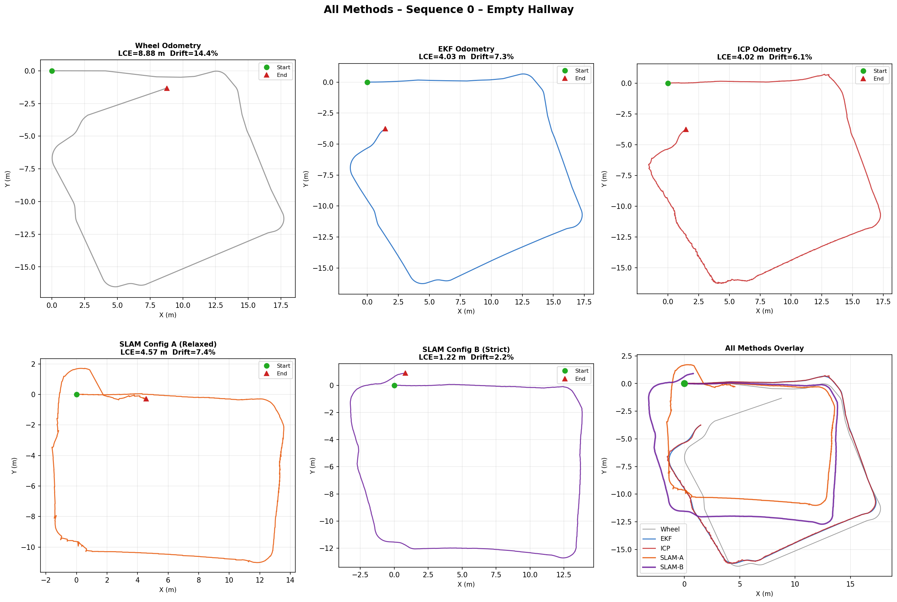

**Sequence 1 – Sharp Turns**
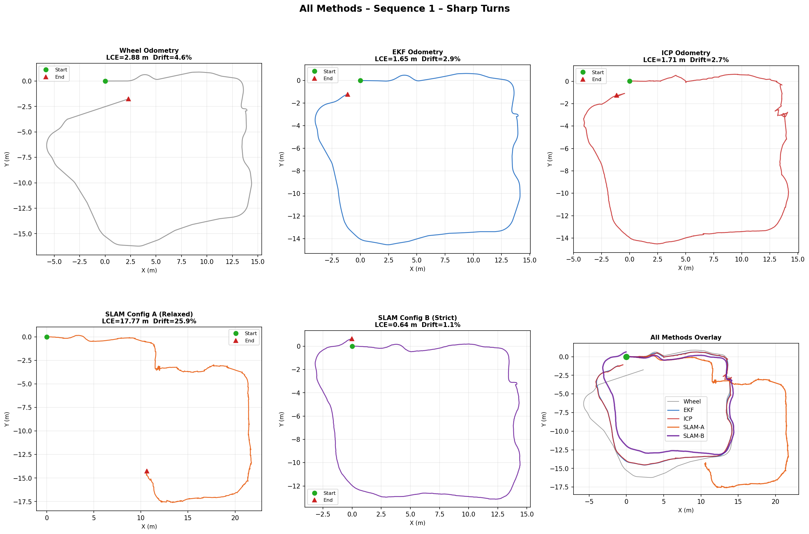

**Sequence 2 – Smooth Motion**
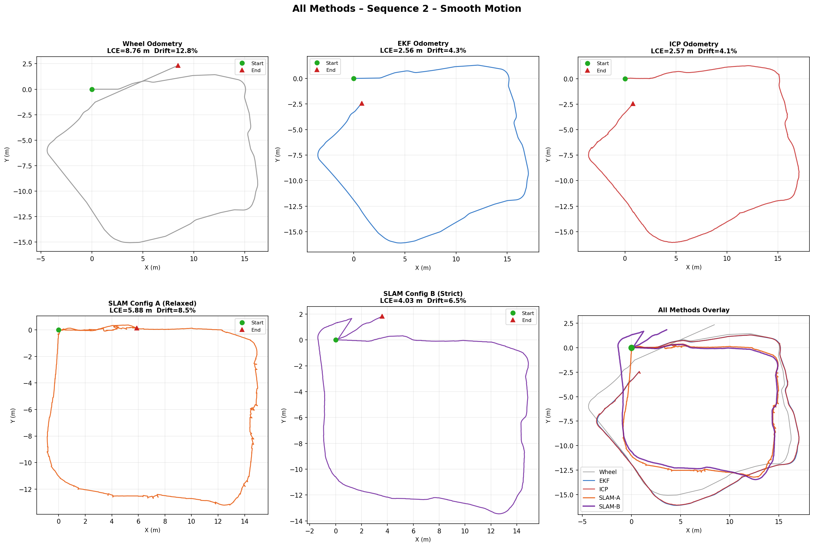

#### Part 1 Quantitative Results

| Sequence | Method | Total Dist (m) | RSE (m) | Drift Rate (%) |
|----------|--------|---------------|---------|---------------|
| Seq 0 | Wheel Odometry | 61.82 | 8.877 | 14.36 |
| Seq 0 | **EKF Odometry** | 55.43 | **4.033** | **7.28** |
| Seq 1 | Wheel Odometry | 62.69 | 2.882 | 4.60 |
| Seq 1 | **EKF Odometry** | 56.39 | **1.711** | **3.03** |
| Seq 2 | Wheel Odometry | 68.59 | 8.761 | 12.77 |
| Seq 2 | **EKF Odometry** | 59.70 | **2.562** | **4.29** |

#### Observations
- EKF reduces drift rate by an average of **−54%** across all three sequences.
- The largest improvements occur on Seq 0 (−49%) and Seq 2 (−66%), both long traversals where heading error dominates the total error budget.
- The gyroscope update is the single most impactful correction — heading drift is the primary failure mode of wheel dead-reckoning.
- Despite the improvement, EKF still accumulates drift because it has no absolute position reference; both sensors are proprioceptive and integrate relative motion only.

---

### 3.2 Part 2 – ICP Odometry Refinement

#### Objective
Refine the EKF-based odometry using LiDAR scan matching (ICP) and evaluate the improvement in accuracy and drift compared to EKF alone.

#### Description
The EKF odometry from Part 1 is used as the initial guess for point-to-point ICP scan matching on consecutive `/scan` messages at 5 Hz. At each scan, ICP finds the optimal rigid-body transform between the current and previous scan via SVD. The result is adaptively blended with the EKF initial guess (5–35% EKF weight) based on scan match quality and integrated to produce a LiDAR-assisted odometry estimate. An occupancy grid map is simultaneously constructed by projecting each scan at its estimated pose.

#### Trajectory Comparison: EKF vs ICP Odometry

ICP trajectories are shown in the all-methods plots above (top row, right panel of each sequence).

#### 2D Occupancy Maps from ICP

The ICP node projects LiDAR scans at each estimated pose to build an occupancy grid. Map sharpness directly reflects the quality of the positional estimates throughout the traversal.

| Sequence 0 | Sequence 1 | Sequence 2 |
|:----------:|:----------:|:----------:|
| 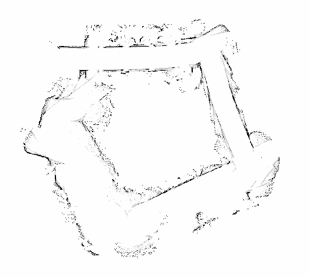 | 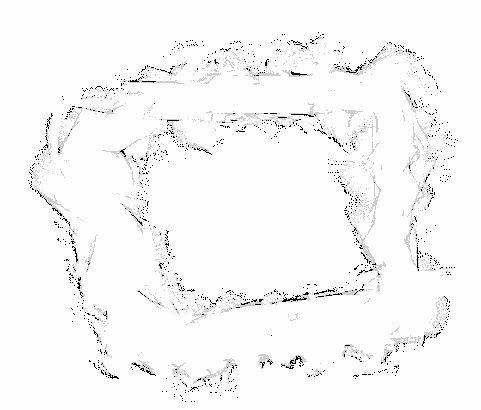 | 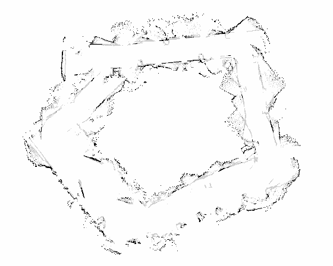 |

#### Part 2 Quantitative Results

| Sequence | Method | Total Dist (m) | RSE (m) | Drift Rate (%) |
|----------|--------|---------------|---------|---------------|
| Seq 0 | EKF Odometry | 55.43 | 4.033 | 7.28 |
| Seq 0 | **ICP Odometry** | 66.11 | **4.025** | **6.09** |
| Seq 1 | EKF Odometry | 56.39 | 1.711 | 3.03 |
| Seq 1 | **ICP Odometry** | 64.00 | **1.709** | **2.67** |
| Seq 2 | EKF Odometry | 59.70 | 2.562 | 4.29 |
| Seq 2 | **ICP Odometry** | 62.46 | **2.567** | **4.11** |

#### Observations
- ICP improves drift rate by an average of **−10.8%** over EKF alone.
- The improvement is derived from 5 Hz scan matching that corrects positional errors undetectable by the IMU (e.g., translational slip, minor floor irregularities).
- Adaptive blending prevents degradation in featureless corridor sections where ICP correspondences are sparse or ambiguous.
- The total distance reported by ICP is consistently higher than EKF because scan matching introduces small high-frequency jitter on straight-line paths.
- ICP uniquely produces a 2D occupancy map alongside the trajectory, providing value beyond localization.

---

### 3.3 Part 3 – Full SLAM with slam_toolbox

#### Objective
Perform full SLAM using `slam_toolbox` and compare pose estimation and mapping performance against the ICP-based odometry from Part 2, with particular attention to the effect of scan-matching search constraints.

#### Description
`slam_toolbox` runs in async mode using `/scan` as the laser input and EKF odometry (`/ekf/odometry`) as the odometric prior. A pose graph is constructed and globally refined via Ceres non-linear optimization with loop closure, producing a globally consistent trajectory and occupancy map. Two configurations are tested to characterise the effect of scan-matching search constraints in corridor environments.

#### Config A (Relaxed) vs Config B (Strict) – SLAM Trajectory

SLAM Config A and Config B trajectories are shown in the all-methods plots in §3.1 (bottom row, left and center panels of each sequence). The most dramatic difference is visible in Sequence 1, where Config A undergoes severe divergence.

**All sequences overview:**

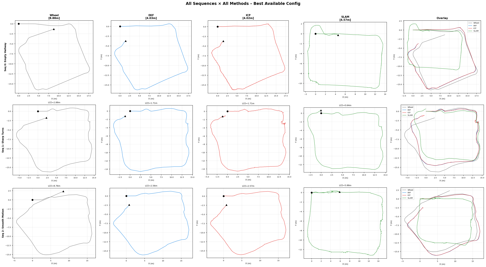

**Config A vs Config B – side-by-side summary:**

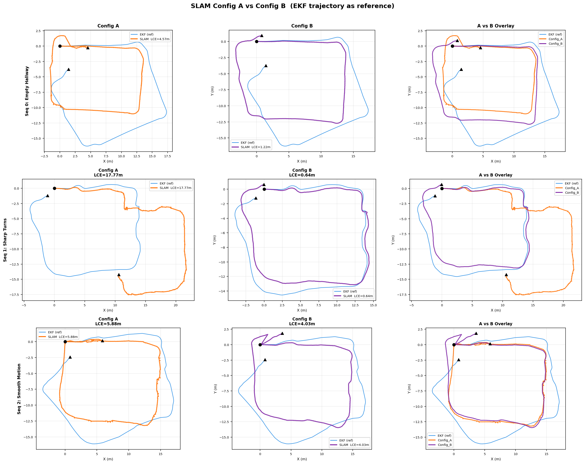

#### 2D Occupancy Maps: ICP vs SLAM Config A vs SLAM Config B

**Sequence 0 – Empty Hallway**

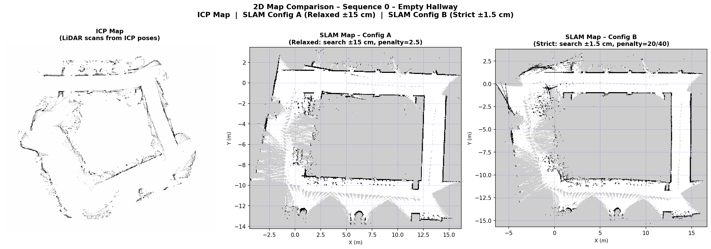

**Sequence 1 – Sharp Turns**

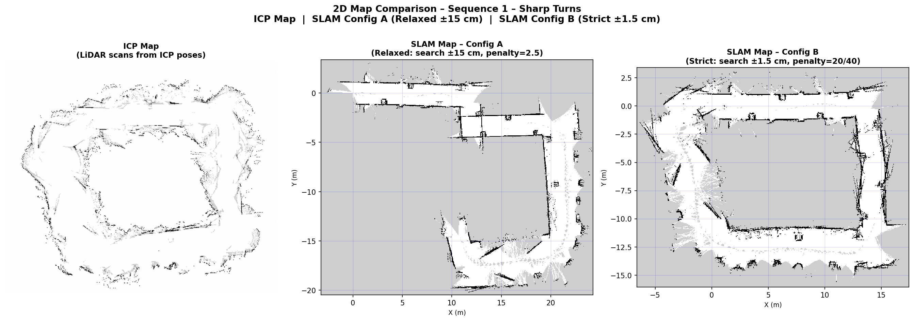

**Sequence 2 – Smooth Motion**

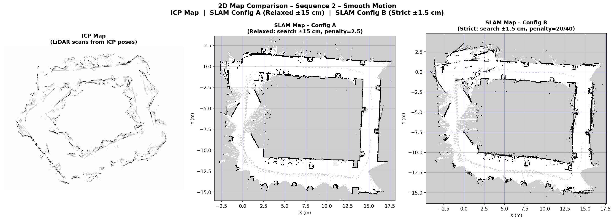

**All sequences map grid (ICP | SLAM-A | SLAM-B):**

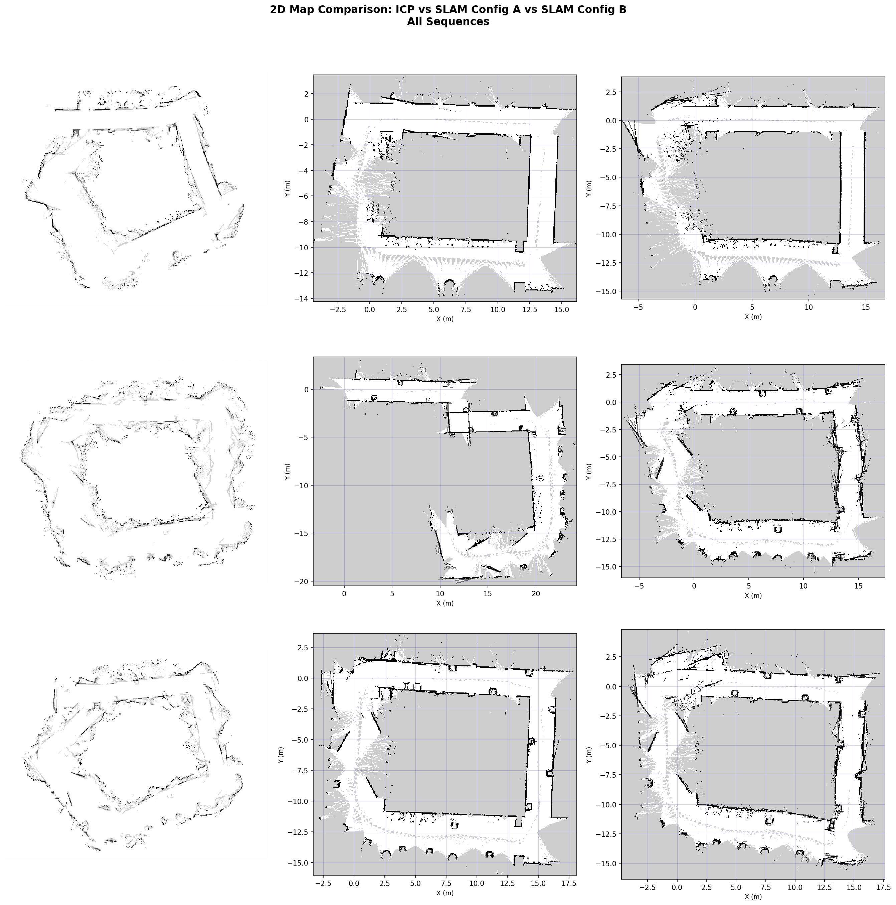

#### Compare-Drift Run (Sequence 0 – All 4 Methods on Identical Data)

The `results/sequence_0/compare_drift/` folder contains a dedicated run with all four methods active simultaneously on the same data stream, providing a direct comparison under identical conditions.

**ICP Map vs SLAM Map:**

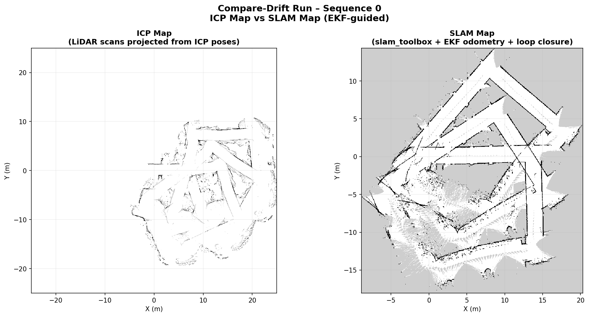

**All 4 method trajectories:**

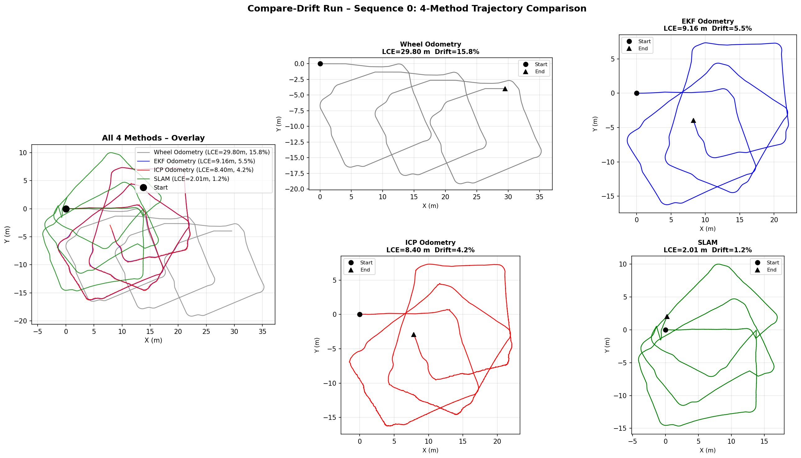

**All 4 trajectories overlaid on occupancy maps:**

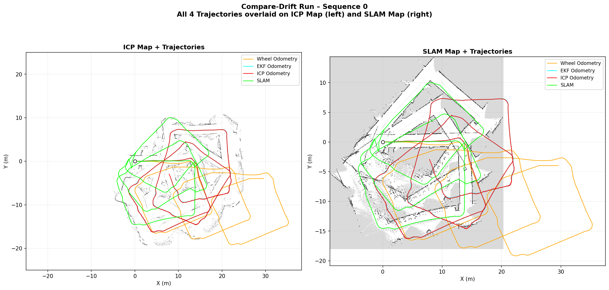

#### Part 3 Quantitative Results

| Sequence | Method | Total Dist (m) | RSE (m) | Drift Rate (%) |
|----------|--------|---------------|---------|---------------|
| Seq 0 | ICP Odometry (reference) | 66.11 | 4.025 | 6.09 |
| Seq 0 | SLAM Config A | 62.05 | 4.567 | 7.36 |
| Seq 0 | **SLAM Config B** | 55.74 | **1.216** | **2.18** |
| Seq 1 | ICP Odometry (reference) | 64.00 | 1.709 | 2.67 |
| Seq 1 | SLAM Config A | 68.56 | 17.766 | 25.91 |
| Seq 1 | **SLAM Config B** | 56.41 | **0.643** | **1.14** |
| Seq 2 | ICP Odometry (reference) | 62.46 | 2.567 | 4.11 |
| Seq 2 | SLAM Config A | 69.62 | 5.883 | 8.45 |
| Seq 2 | **SLAM Config B** | 62.11 | **4.033** | **6.49** |

#### Observations
- **Config B (Strict) consistently outperforms Config A** across all three sequences by large margins.
- The most critical failure case is Sequence 1: Config A drifts 25.91% (RSE = 17.77 m) while Config B achieves only 1.14% (RSE = 0.64 m). The relaxed ±15 cm search space triggers false scan correspondences in the symmetric left-right corridor geometry — a perceptual aliasing failure discussed in detail in §4.3.
- Config B forces SLAM to remain close to the EKF estimate via high variance penalties, effectively using EKF as a strong Gaussian prior and employing scan matching only for local refinement.
- Loop closure in Config B further removes accumulated drift when the robot revisits previously mapped regions.
- SLAM Config B produces the sharpest occupancy maps with consistent, clean wall representations across all sequences.

| Map Quality | ICP | SLAM Config A | SLAM Config B |
|-------------|-----|--------------|--------------|
| Seq 0 | Clear walls, slight blur | Blurry from drift | Sharp, clean walls |
| Seq 1 | Turn artifacts | **Badly distorted** | Best quality |
| Seq 2 | Smooth corridors | Moderate distortion | Good quality |

---

### 3.4 Overall Comparison

#### Full Results Table (All Methods, All Sequences)

| Method | Config | Seq | Total Dist (m) | RSE (m) | Drift Rate (%) |
|--------|--------|-----|---------------|---------|---------------|
| Wheel  | A | 0 | 61.82 | 8.877 | 14.36 |
| EKF    | A | 0 | 55.43 | 4.033 |  7.28 |
| ICP    | A | 0 | 66.11 | 4.025 |  6.09 |
| SLAM   | A | 0 | 62.05 | 4.567 |  7.36 |
| SLAM   | **B** | 0 | 55.74 | **1.216** | **2.18** |
| Wheel  | B | 1 | 62.69 | 2.882 |  4.60 |
| EKF    | B | 1 | 56.39 | 1.711 |  3.03 |
| ICP    | B | 1 | 64.00 | 1.709 |  2.67 |
| SLAM   | A | 1 | 68.56 | 17.766 | 25.91 |
| SLAM   | **B** | 1 | 56.41 | **0.643** | **1.14** |
| Wheel  | A | 2 | 68.59 | 8.761 | 12.77 |
| EKF    | A | 2 | 59.70 | 2.562 |  4.29 |
| ICP    | A | 2 | 62.46 | 2.567 |  4.11 |
| SLAM   | A | 2 | 69.62 | 5.883 |  8.45 |
| SLAM   | **B** | 2 | 62.11 | **4.033** | **6.49** |

#### Average Drift Rate Summary

| Method | Avg Drift Rate | vs Wheel Odometry |
|--------|---------------|---------|
| Wheel Odometry | 10.58% | baseline |
| EKF Odometry | 4.87% | **−54%** |
| ICP Odometry | 4.29% | **−59%** |
| SLAM Config A | 13.91% | worse (catastrophic failure Seq 1) |
| SLAM Config B | **3.27%** | **−69%** |

**Overall accuracy ranking:** SLAM Config B > ICP ≈ EKF > Wheel Odometry >> SLAM Config A

#### Robustness Comparison

| Method | Computation | Slip Robustness | Feature Dependency | Long-term Stability |
|--------|-------------|-----------------|-------------------|---------------------|
| Wheel Odometry | Very Fast | Poor | None | Poor |
| EKF Odometry | Fast | Moderate | None | Fair |
| ICP Odometry | Medium | Good | High | Fair |
| SLAM Config A | Slow | Good | High | Variable (fragile) |
| SLAM Config B | Slow | Good | High | **Excellent** |

#### Key Findings

1. **EKF (Part 1) reduces drift by ~54% vs wheel-only.** The gyroscope update corrects heading drift — the dominant error source in dead-reckoning — without requiring external geometric measurements.
2. **ICP (Part 2) further reduces drift by ~11% vs EKF.** Adaptive blending prevents degradation in featureless corridor sections while scan matching corrects translational slip that the IMU cannot observe.
3. **SLAM Config B (Part 3) achieves the best overall accuracy (avg 3.27% drift).** Strict variance penalties prevent corridor ambiguity by anchoring the pose graph to EKF. Loop closure provides global consistency not available to any odometric method.
4. **SLAM Config A is unreliable in symmetric corridor environments.** A wide search space (±15 cm) causes catastrophic failure on Seq 1 (25.91% drift) due to perceptual aliasing. Config B is the required configuration for this environment type.
5. **Only SLAM produces a globally consistent 2D map**, making it uniquely suitable for autonomous navigation tasks that require metric map information beyond mere trajectory tracking.

---

## 4. Discussion

### 4.1 Scenario-Specific Analysis

The three sequences represent qualitatively distinct motion regimes, each exposing different sensitivity patterns across the localization methods.

#### Sequence 0 – Long Symmetric Corridor

Sequence 0 involves a long traversal of a relatively straight corridor — the canonical worst case for dead-reckoning. On a straight path, any heading error θ_error causes a lateral position deviation that grows as ∫v·sin(θ_error) dt, approximately proportional to v·θ_error·T for small errors over time T. The 14.36% drift rate confirms that heading error dominates translational error on this sequence.

EKF nearly halves the error (7.28%) because the gyroscope provides a direct, independent measurement of ω, decoupled from wheel-surface contact mechanics. The bilateral symmetry of the corridor poses a mild challenge for both ICP and SLAM Config A: the left and right walls present nearly identical point distributions, so the scan matcher can, in principle, mistake one wall for the other. ICP's adaptive blending mitigates this by falling back toward the EKF estimate when correspondence counts are low, yielding a modest further improvement (6.09%). SLAM Config B's dominant performance (2.18%) is attributable primarily to loop closure: when the robot passes near its starting position, the closure constraint absorbs the accumulated drift in a single global graph optimization step.

#### Sequence 1 – Sharp Turns in a Narrow Corridor

This sequence contains multiple abrupt direction changes within a narrow, geometrically symmetric corridor. It is the hardest scenario for scan matching but is relatively benign for wheel odometry and EKF (low baseline drifts of 4.60% and 3.03% respectively), because the compact, angular trajectory means heading errors partially cancel across successive opposite turns.

The gyroscope is maximally informative during turns — it directly measures the angular velocity at its highest magnitude — which explains why EKF achieves its best relative improvement on this sequence. ICP benefits from the EKF initial guess, which provides a good rotation estimate before the ICP iterations begin; without this, the large inter-scan rotations during sharp turns would reliably cause ICP to converge to a local minimum.

SLAM Config A fails catastrophically on this sequence (25.91%, RSE = 17.77 m). The failure is not gradual drift but a discrete topological error: the pose graph "folds" onto a false solution consistent with false scan correspondences identified during one or more sharp turns. This failure is discussed in detail in §4.3.

SLAM Config B achieves 1.14% drift — the best result of all methods across all sequences — because the strict constraints and loop closure together provide global consistency that no odometric method can match.

#### Sequence 2 – Smooth Continuous Motion

Sequence 2 represents gradual curvature at moderate speed. The longer path (68.59 m for wheel odometry) accumulates more total drift, but the smooth heading evolution means ICP correspondences are reliable throughout most of the sequence. EKF performs well (4.29%), and ICP provides only marginal additional benefit (4.11%), suggesting that gradual turns produce fewer high-quality perpendicular scan features than sharp right-angle turns. SLAM Config B achieves 6.49% — slightly higher than on the other sequences — suggesting fewer or lower-quality loop closure opportunities when the trajectory has less revisitation of prior poses.

---

### 4.2 Why Each Method Succeeds or Fails

#### Dead-Reckoning: Theoretical Drift Bound

The heading error accumulated over path length *s* is approximately:

```
θ_error(s) ≈ ∫₀ˢ (slip_R(σ) − slip_L(σ)) / L dσ
```

For the TurtleBot3 Burger (L = 0.16 m), a persistent 0.1% asymmetric slip ratio between left and right wheels generates ≈ 3.9 mrad/m of heading error. Over a 62 m path, this results in a final heading offset of ≈ 14°, which geometrically produces a lateral return error consistent with the observed RSE values. Floor surface transitions (tile joints, rubber mat edges) introduce impulsive, uncorrectable slip events that accelerate this error accumulation.

#### EKF: Correcting the Dominant Error Source

The EKF succeeds primarily because the gyroscope and the wheel encoders measure heading through entirely independent physical mechanisms. Wheel-based angular velocity estimation is corrupted by differential slip; gyroscope measurement is corrupted by thermal bias drift. At the timescale of these experiments (5–10 minutes), the gyroscope's static bias — calibrated out at startup — dominates over residual thermal drift. The filter correctly down-weights the wheel-based ω estimate (R_odom[1,1] = 0.0031 rad²/s²) relative to the gyroscope (R_gyro = 0.0030 rad²/s²), producing a nearly equal weighting that leverages both sources without over-committing to either.

EKF cannot eliminate drift because both sensors are proprioceptive. The 5-state augmented formulation helps by smoothing velocity estimates, but the position states [x, y, θ] still integrate these estimates without an external reference, and errors accumulate without bound.

#### ICP Odometry: Geometric Consistency Without Global Correction

ICP succeeds in structured environments because wall surfaces provide consistent perpendicular features across successive scans. The SVD step finds the globally optimal rigid-body transform given the correspondence set — it is a least-squares optimum, not an approximation. The EKF initial guess resolves the initialization sensitivity of ICP: provided the initial guess places the source scan within the basin of convergence of the correct local minimum, ICP converges reliably within 10–30 iterations on 360-point TurtleBot3 scans.

ICP fails in three distinct modes:
1. **Feature sparsity:** Fewer than 20 valid correspondences (open glass areas, perpendicular doorways) cause the adaptive blending to revert to the EKF delta entirely.
2. **Corridor degeneracy:** In a perfectly symmetric corridor, the ICP cost surface has two nearly equal local minima (matching to the left vs right wall). The 1.2 m correspondence distance threshold is deliberately large to handle long-range wall features, but this also admits incorrect cross-corridor matches.
3. **Absence of loop closure:** ICP accumulates error as an odometric method. Even with perfect per-step matching, a 0.1% per-step residual error over 300 scans (a 60 m path at 5 Hz and 0.2 m/s) produces a non-negligible final error. There is no mechanism to recognise revisitation and remove this accumulated error.

#### SLAM Config A: The Perceptual Aliasing Catastrophe

The `correlation_search_space_dimension = 0.3 m` parameter means the scan-to-map matcher evaluates candidate poses within a 0.3 m × 0.3 m region around the odometry prediction. In a symmetric corridor of width ≈ 1.5 m, this search space is large enough to span from one wall to the other at the corridor midpoint. The scan-matching cost function — the sum of scan point likelihoods under the current map — can produce similar scores for the true pose and a reflected pose on the opposite wall, because the wall geometry is nearly mirror-symmetric.

When the pose graph optimizer accepts such a false correspondence (the scan quality threshold `link_match_minimum_response_fine = 0.3` is relatively permissive), all subsequent poses are built on this corrupted foundation. The global Ceres optimization cannot recover because the false constraint is consistent with the symmetric environment model. On Sequence 1, this produces the observed topological failure: RSE = 17.77 m represents the robot's estimated trajectory diverging to a spatially inconsistent map, not merely drifted dead-reckoning. This class of failure — **perceptual aliasing** — is one of the principal unsolved problems in SLAM for featureless or repetitively structured environments.

#### SLAM Config B: EKF as a Strong Prior Against Degeneracy

Config B's design addresses perceptual aliasing by restricting the scan-matching search to ±1.5 cm around the EKF prediction. Within this small neighborhood, the cost surface is unimodal (there is only one geometrically consistent pose within 1.5 cm of the predicted pose). The high `distance_variance_penalty = 20` and `angle_variance_penalty = 40` encode this constraint in the Ceres cost function: the optimizer pays a large penalty for any scan-matched pose that deviates from the odometry prior.

This is equivalent to treating the EKF estimate as a tight Gaussian prior over the pose. The Ceres optimizer then finds the maximum a posteriori (MAP) estimate that balances scan-matching data likelihood with this prior — and because the prior is tight and the EKF quality is high (drift rate 3–7%), the result is consistently near-optimal.

Loop closure operates on a separate, longer timescale: only when the robot genuinely revisits a previously mapped area, with unambiguous geometric overlap, does the loop closure matcher fire. This selective activation prevents false loop closures while allowing the global pose graph correction when revisitation is genuine.

---

### 4.3 Perceptual Aliasing and SLAM Configuration

Perceptual aliasing occurs when distinct physical locations produce indistinguishable (or nearly indistinguishable) sensor measurements. In LiDAR-based SLAM, the primary aliasing scenario is bilateral corridor symmetry: from any point along the corridor centreline, the scan returns from the left and right walls are related by a reflection, producing similar scan signatures. A scan matcher with a wide search space may therefore accept a reflected pose as a valid match, causing the pose graph to fold onto a false solution.

The Config A vs Config B experiment provides a controlled demonstration of this failure mode. The only structural difference between the two configurations is the size of the search space and the strength of the odometry penalty. Config A's permissive search finds false correspondences during sharp turns (Sequence 1) when the robot's heading changes by 90° or more, temporarily presenting the sensor with a rotated but geometrically similar corridor profile. Config B's narrow search, anchored to the EKF heading estimate, avoids this failure entirely.

A key design insight from this experiment is that **the reliability of SLAM is bounded by the quality of its odometric prior in symmetric environments**. A high-quality EKF prior (3–7% drift) enables a correspondingly tight search constraint, which in turn prevents the aliasing failure. This interdependence motivates the pipeline architecture: EKF enables Config B, which enables reliable SLAM.


### 4.4 Method Selection Guidelines

Based on the experimental evidence, the following selection criteria are proposed:

**Wheel Odometry** is appropriate only as a baseline diagnostic or for extremely short trajectories (< 5 m) where accumulated drift is negligible.

**EKF Odometry** is the recommended minimum for indoor mobile robots. It is computationally trivial, requires no external features, and reduces drift by ≈54% over dead-reckoning. It forms the essential prior for both ICP and SLAM in this pipeline.

**ICP Odometry** is appropriate when a 2D occupancy map is needed concurrently with odometry, when the robot operates in well-structured environments with rich geometric features, and when loop closure is not expected (the trajectory does not revisit earlier areas). It is inappropriate when the environment contains extended featureless regions or when long-term global consistency is required.

**SLAM with tight constraints (Config B)** is the appropriate choice when globally consistent mapping is the primary objective, when the robot is expected to revisit previously mapped areas (enabling loop closure), and when a reliable odometric prior (EKF-quality or better) is available. Without a reliable prior, a tight search constraint cannot be justified — if the odometry is poor, the strict Config B search space may simply restrict the scan matcher to the wrong neighborhood.

**SLAM with relaxed constraints (Config A)** should be avoided in symmetric indoor corridor environments. It may be appropriate in environments with rich, unambiguous geometric landmarks (cluttered labs, environments with distinct object patterns) where the wide search space helps find better scan alignments without the risk of false symmetric matches.

---

### 4.5 Metric Limitations

The Return-to-Start Error (RSE) metric is a practical but imperfect evaluation criterion with two important limitations:

1. **Path-internal errors are invisible:** RSE only measures the displacement between trajectory endpoints. A trajectory that deviates substantially at mid-path but returns close to the start (e.g., via a compensating error in the second half) would show a low RSE while the intermediate localization quality was poor. This limitation is partially addressed by examining occupancy map sharpness as a qualitative proxy for path-internal accuracy.

2. **Ground truth dependency:** RSE implicitly assumes the robot's physical path forms a closed loop, i.e., the physical end-point coincides with the start-point. If the physical trajectory does not close (which depends on robot motion, not just the localization algorithm), RSE measures a combination of localization error and non-closure of the physical path.

Standard benchmarking metrics — Absolute Trajectory Error (ATE) and Relative Pose Error (RPE) per [Sturm et al., 2012] — require ground-truth trajectories from external reference systems (motion capture, differential GPS, or survey-grade total station). Future work should incorporate such ground truth to enable quantitative comparison against published SLAM benchmarks.

---

## 5. Limitations

The following known limitations constrain the conclusions drawn from this work:

1. **Mahalanobis gating threshold is effectively inactive.** The threshold value of 2,000,000 means all measurements are accepted regardless of statistical consistency. The theoretically motivated threshold at 95% confidence for a 2D measurement innovation is χ²(2, 0.95) = 5.99. Activating proper gating could improve EKF robustness during motion disturbances (e.g., bumps, manual handling).

2. **No external ground truth.** All error metrics rely on the return-to-start assumption. Rigorous evaluation requires ground truth from a motion capture system or survey-grade positioning.

3. **Partial IMU bias calibration.** Only accelerometer biases (X and Y axes) are estimated from the 75-sample startup routine. The gyroscope Z-axis bias (`gyro_bias_z`) is hardcoded to `0.00 rad/s` and never estimated from data. Any non-zero gyro DC bias propagates directly into heading error at a rate equal to the bias magnitude. For longer missions or sensors with significant gyro offsets, online bias estimation via state augmentation is required.

4. **ICP frequency mismatch with robot dynamics.** At 5 Hz, the ICP update rate is matched to LiDAR frame rate but means that rapid disturbances between scans (slip events, unexpected obstacles) are unobserved for up to 200 ms.

5. **Single-robot, single-floor, controlled conditions.** All sequences are from one indoor floor under consistent lighting. Generalization to multi-floor environments, outdoor operation, or dynamic obstacle-rich scenes would require additional validation.

6. **SLAM Config B's robustness is contingent on EKF quality.** The strict ±1.5 cm search constraint works only because the EKF provides drift rates of 3–7%. If the EKF degrades (e.g., IMU failure, extreme wheel slip), Config B would constrain the scan matcher to search the wrong neighbourhood, potentially producing worse results than Config A.

7. **EKF first-order linearization error.** The EKF propagates uncertainty through a first-order Taylor expansion of the motion model, represented by the analytically derived Jacobian **F**. This linearization is exact only when the true posterior is Gaussian and the nonlinearity is mild over the prediction interval. For a differential-drive robot executing sharp turns at higher speeds, the arc-model nonlinearity `sin(θ + ω·dt)` can be significant over a single 50 ms step, causing the linearized covariance to underestimate the true uncertainty and potentially leading to filter inconsistency. The Unscented Kalman Filter (UKF) addresses this by propagating a deterministically chosen set of sigma points through the exact nonlinear model, achieving third-order accuracy for Gaussian inputs without requiring Jacobian computation. For the low-speed, short-horizon sequences evaluated here the linearization error is acceptable, but for high-speed manoeuvres or longer prediction intervals UKF is the recommended replacement.

8. **Unknown exact loop-closure endpoint.** The RSE metric assumes the robot's physical end-point coincides precisely with its physical start-point. However, the dataset does not include an independent measurement of where the robot actually stopped relative to where it began. Any non-zero physical loop-opening distance (due to the robot not completing a geometrically perfect closed loop) is indistinguishable from localization error in the RSE value. Consequently, reported RSE figures represent an upper bound on true localization error and cannot be decomposed into path-closure error and algorithmic drift without an external reference measurement.

*Last updated: February 2026*
