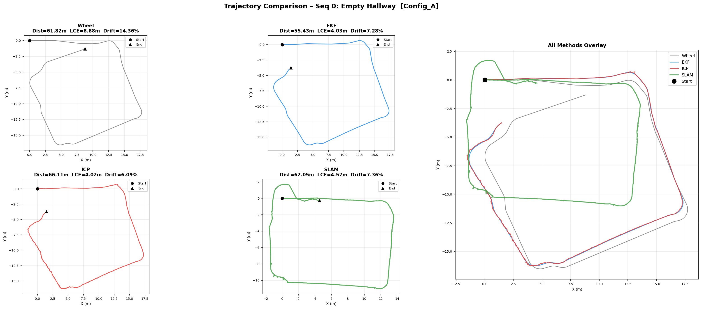
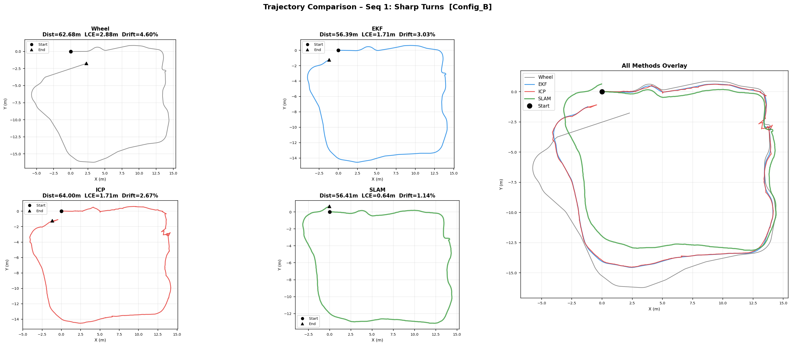
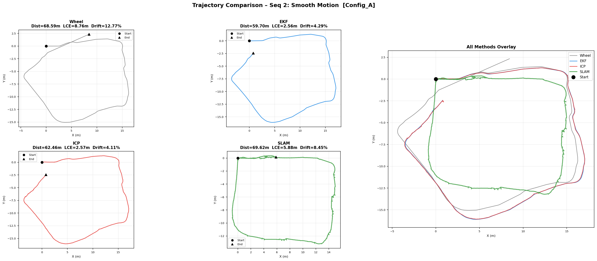

# FRA532 Mobile Robotics – Lab 1: EKF / ICP / SLAM

**Student:** Bhumipat Ngamphueak
**ID:** 66340500043
**Course:** FRA532 Mobile Robotics
**Lab:** Lab 1 – EKF Odometry Fusion, ICP Refinement, and Full SLAM

---

## Table of Contents

1. [Setup](#1-setup)
2. [What We Do](#2-what-we-do)
   - [Differential Drive Model & Wheel Odometry](#21-differential-drive-model--wheel-odometry)
   - [Extended Kalman Filter (EKF)](#22-extended-kalman-filter-ekf)
   - [ICP Odometry Refinement](#23-icp-odometry-refinement)
   - [SLAM with slam_toolbox](#24-slam-with-slam_toolbox)
3. [Results](#3-results)
   - [Configuration Definition](#31-configuration-definition)
   - [Trajectory Plots](#32-trajectory-plots)
   - [Generated Maps](#33-generated-maps)
   - [Quantitative Metrics](#34-quantitative-metrics)
   - [Discussion](#35-discussion)

---

## 1. Setup

### Prerequisites

| Requirement | Version |
|-------------|---------|
| OS | Ubuntu 22.04 |
| ROS 2 | Humble |
| Python | 3.10+ |
| Robot | TurtleBot3 Burger |

### Step-by-Step Installation

**Step 1 – Clone the repository**
```bash
cd ~/
git clone <repository_url> Mobile_Robot
cd Mobile_Robot
```

**Step 2 – Install ROS 2 dependencies**
```bash
sudo apt update
sudo apt install -y \
    ros-humble-slam-toolbox \
    ros-humble-nav2-map-server \
    ros-humble-tf2-ros \
    ros-humble-tf2-tools
```

**Step 3 – Install Python dependencies**
```bash
pip3 install numpy scipy pandas matplotlib
```

**Step 4 – Place the dataset**

Download the FRA532 Lab 1 dataset and place the sequence folders under:
```
src/FRA532_LAB1_DATASET/
├── fibo_floor3_seq00/
├── fibo_floor3_seq01/
└── fibo_floor3_seq02/
```

**Step 5 – Build the workspace**
```bash
colcon build
source install/setup.bash
```

> **Tip:** colcon installs Python scripts and config files as symlinks. You can edit source files directly without rebuilding.

### Running Each Part

**Part 1 – EKF Odometry Fusion**
```bash
source install/setup.bash
ros2 launch ekf_filter part1_ekf_fusion.launch.py
```
Outputs: `results/wheel_odometry.csv`, `results/ekf_odometry.csv`, `results/imu_data.csv`

**Part 2 – ICP Odometry Refinement**
```bash
source install/setup.bash
ros2 launch ekf_filter part2_icp_refinement.launch.py
```
Outputs: `results/icp_odometry.csv`, `results/icp_map.pgm`, `results/icp_map.yaml`

**Part 3 – Full SLAM** (with optional RViz2)
```bash
source install/setup.bash
ros2 launch ekf_filter part3_slam.launch.py
# or with visualization:
ros2 launch ekf_filter part3_slam_with_rviz.launch.py
```
Outputs: `results/slam_trajectory.csv`, `results/slam_map.pgm`, `results/slam_map.yaml`

**Generate all comparison plots**
```bash
python3 scripts/plot_all_results.py
```

### Repository Structure

```
Mobile_Robot/
├── src/
│   ├── differential_drive_model/
│   │   └── scripts/
│   │       ├── read_data_node.py          # Rosbag replay with timestamp re-sync
│   │       └── wheel_odometry_node.py     # Dead-reckoning from wheel encoders
│   └── ekf_filter/
│       ├── config/
│       │   ├── mapper_params_online_async_B.yaml    # SLAM Config B (strict, active)
│       │   └── mapper_params_online_async_saved_not_use.yaml  # SLAM Config A (relaxed)
│       ├── launch/
│       │   ├── part1_ekf_fusion.launch.py
│       │   ├── part2_icp_refinement.launch.py
│       │   ├── part3_slam.launch.py
│       │   └── part3_slam_with_rviz.launch.py
│       └── scripts/
│           ├── part1/
│           │   ├── ekf_odometry_node.py   # 5-state EKF (wheel + IMU fusion)
│           │   └── wheel_odometry_node.py
│           ├── part2/
│           │   └── icp_odometry_node.py   # ICP scan matching with adaptive blending
│           ├── part3/
│           │   └── scan_republisher_node.py
│           ├── auto_map_saver_node.py
│           ├── icp_map_builder_node.py
│           ├── path_publisher_node.py
│           ├── read_data_node.py
│           └── slam_trajectory_saver_node.py
├── scripts/
│   └── plot_all_results.py                # Generates all trajectory plots + metrics
└── results/
    ├── sequence_0/Config_A/ and Config_B/
    ├── sequence_1/Config_A/ and Config_B/
    └── sequence_2/Config_A/ and Config_B/
```

---

## 2. What We Do

This lab implements a 2D localization pipeline with four progressive methods, each adding more sensor information and algorithmic sophistication.

| Part | Method | Sensors |
|------|--------|---------|
| 1 | Wheel Odometry (baseline) | `/joint_states` |
| 1 | EKF Odometry Fusion | `/joint_states` + `/imu` |
| 2 | ICP Odometry Refinement | `/scan` (EKF as initial guess) |
| 3 | Full SLAM | `/scan` + EKF odometry |

---

### 2.1 Differential Drive Model & Wheel Odometry

The baseline method integrates wheel encoder ticks using the differential-drive kinematic model.

**Robot geometry (TurtleBot3 Burger):**

| Parameter | Value |
|-----------|-------|
| Wheel radius (`r`) | 0.033 m |
| Wheel separation (`L`) | 0.160 m |

**Velocity computation from encoder ticks:**
```
v     = r/2 * (dφ_R + dφ_L) / dt
omega = r/L * (dφ_R - dφ_L) / dt
```

**Dead-reckoning integration** (Euler, 20 Hz):
```
x_new = x + v·cos(θ)·dt
y_new = y + v·sin(θ)·dt
θ_new = θ + omega·dt
```

This accumulates unbounded error over time, especially in heading, because wheel slip and small calibration errors in `r` and `L` are never corrected.

---

### 2.2 Extended Kalman Filter (EKF)

The EKF fuses wheel encoder data with the IMU to reduce drift, particularly heading drift from the gyroscope.

**State vector:** `[x, y, θ, v, ω]` — position, heading, linear velocity, angular velocity

#### Prediction Step (20 Hz, from `/joint_states`)

For curved motion (`|ω| > 1×10⁻⁶ rad/s`):
```
x_new = x + (v/ω)(sin(θ + ω·dt) − sin(θ))
y_new = y + (v/ω)(−cos(θ + ω·dt) + cos(θ))
θ_new = θ + ω·dt
```

For straight-line motion (`ω ≈ 0`):
```
x_new = x + v·cos(θ)·dt
y_new = y + v·sin(θ)·dt
θ_new = θ
```

Covariance prediction: `P_pred = F·P·Fᵀ + Q`
where `F` is the analytically-derived Jacobian of the motion model.

#### Measurement Updates (20 Hz, from `/imu`)

Three independent updates are applied per IMU callback:

1. **Gyroscope update** — directly measures `ω`
   `H = [0, 0, 0, 0, 1]` → updates `state[4]`

2. **Accelerometer update** — integrates `a_x` to refine `v`
   Applied only when `|a_x| > 0.05 m/s²` (ignores noise when nearly still)
   `H = [0, 0, 0, 1, 0]` → updates `state[3]`

3. **Centripetal acceleration update** — uses `a_y ≈ v·ω` to refine `ω` during turns
   Applied only when `|v| > 0.05 m/s` and `|a_y| > 0.02 m/s²`
   `H = [0, 0, 0, 0, 1]` → updates `state[4]`

**Wheel encoder update** (per `/joint_states` callback):
Computes `[v_odom, ω_odom]` and updates `state[3:5]`.

#### Outlier Rejection

Mahalanobis distance gating applied to every update:
`d² = (z − Hx)ᵀ (H·P·Hᵀ + R)⁻¹ (z − Hx)`
Measurements with `d² > threshold` are silently rejected.

#### IMU Bias Calibration

The first 75 IMU samples (while the robot is stationary) are averaged to estimate and remove accelerometer bias (`bias_x`, `bias_y`).

#### EKF Hyperparameters

| Parameter | Value | Description |
|-----------|-------|-------------|
| `Q` | diag([0.01]×5) | Process noise covariance |
| `R_imu_gyro` | 0.0030 (rad/s)² | Gyroscope noise |
| `R_imu_accel` | 0.1907 (m/s²)² | Accelerometer noise |
| `R_odom` | diag([0.0005, 0.0031]) | Wheel odometry noise [v, ω] |
| `R_centripetal` | 2.0 (rad/s)² | Centripetal ω estimate noise |
| Bias calibration | 75 samples | Stationary IMU samples for bias estimation |
| TF publish rate | 50 Hz | Prevents RViz transform extrapolation |

---

### 2.3 ICP Odometry Refinement

ICP matches consecutive LiDAR scans to estimate the incremental transform and integrates it into a global pose. The EKF delta is used only as the **initial guess** for ICP (not directly in the output).

#### Algorithm (per scan, 5 Hz)

1. Convert `LaserScan` to 2D point cloud (range filter: `range_min < r < range_max`)
2. Use EKF delta `[dx, dy, dθ]` as the initial transform
3. **ICP loop** (max 200 iterations, tolerance 1×10⁻⁵):
   - Build KD-tree on target scan
   - Find nearest-neighbor correspondences (distance < 1.2 m)
   - Reject outlier pairs
   - Compute optimal rotation `R` via SVD on cross-covariance: `H = src_c.T · tgt_c`
   - Extract translation: `t = tgt_mean − R·src_mean`
   - Update accumulated transform; check convergence
4. **Adaptive blending** of ICP result with EKF initial guess:
   - Quality score = `n_correspondences / max_correspondences × (1 − normalized_error)`
   - High quality → low EKF trust (min 5%)
   - Low quality → high EKF trust (max 35%)
   - Rotation gets extra +10% EKF trust (IMU gyro is more reliable than scan matching for heading)
   - If ICP diverges or has < 20 correspondences → use EKF 100%
5. Integrate final `[dx, dy, dθ]` into global pose

#### ICP Hyperparameters

| Parameter | Value | Description |
|-----------|-------|-------------|
| `max_iterations` | 200 | Maximum ICP iterations per scan |
| `tolerance` | 1×10⁻⁵ | Convergence threshold (mean error change) |
| `max_correspondence_dist` | 1.2 m | Maximum point-pair distance for matching |
| `min_ekf_trust` | 5% | EKF weight at highest ICP quality |
| `max_ekf_trust` | 35% | EKF weight at lowest ICP quality |
| `rotation_ekf_bonus` | +10% | Extra EKF trust for heading (gyro is accurate) |
| `min_correspondences` | 20 | Minimum matches; below this use EKF 100% |

---

### 2.4 SLAM with slam_toolbox

Full SLAM uses `async_slam_toolbox_node` with EKF odometry as the odometry input and `/scan` as the laser source.

**Key features:**
- Scan-to-map matching at every pose (`use_scan_matching: true`)
- Pose graph optimization with loop closure (`do_loop_closing: true`)
- Ceres non-linear solver: `SPARSE_NORMAL_CHOLESKY` + `SCHUR_JACOBI` + `LEVENBERG_MARQUARDT`
- EKF odometry as the odometry source (high quality input)

#### SLAM Configurations

Two configurations were tested to study the effect of scan-matching search constraints:

| Parameter | Config A (Relaxed) | Config B (Strict) |
|-----------|-------------------|-------------------|
| `correlation_search_space_dimension` | 0.3 m (±15 cm) | 0.03 m (±1.5 cm) |
| `distance_variance_penalty` | 2.5 | **20.0** |
| `angle_variance_penalty` | 2.5 | **40.0** |
| `loop_match_minimum_response_fine` | 0.5 | 0.5 |
| `link_match_minimum_response_fine` | 0.3 | 0.3 |
| `resolution` | 0.05 m/px | 0.05 m/px |
| `max_laser_range` | 3.5 m | 3.5 m |
| `minimum_travel_distance` | 0.2 m | 0.2 m |

**Config A (Relaxed):** Allows the scan matcher to search a wide area (±15 cm). This can find better scan matches in open environments but is prone to false correspondences in symmetric corridor geometry (both walls look identical).

**Config B (Strict):** Constrains the search space to ±1.5 cm and applies strong variance penalties to force SLAM to closely follow EKF odometry. The high `distance_variance_penalty=20` and `angle_variance_penalty=40` prevent the pose graph from diverging from the EKF estimate, making SLAM more robust to corridor ambiguity.

> **Active configuration:** `Part 3` launch files use **Config B** (`mapper_params_online_async_B.yaml`).

---

## 3. Results

### 3.1 Configuration Definition

The table below defines exactly which SLAM configuration was used for each sequence and method.

| Sequence | Wheel Odometry | EKF Odometry | ICP Odometry | SLAM |
|----------|---------------|--------------|--------------|------|
| Sequence 0 | Config A | Config A | Config A | **Both A and B** |
| Sequence 1 | Config B | Config B | Config B | **Both A and B** |
| Sequence 2 | Config A | Config A | Config A | **Both A and B** |

> **Note:** Wheel, EKF, and ICP methods are pure odometry — they do not depend on SLAM config. The "Config A/B" column for these methods indicates which run the data was collected from. SLAM was run separately with both configurations on all three sequences.

**Datasets used:**

| Sequence | Rosbag file | Description |
|----------|------------|-------------|
| Sequence 0 | `fibo_floor3_seq00_0.db3` | Empty hallway, straight corridor |
| Sequence 1 | `fibo_floor3_seq01_0.db3` | Sharp turns, obstacles |
| Sequence 2 | `fibo_floor3_seq02_0.db3` | Smooth non-aggressive motion |

---

### 3.2 Trajectory Plots

#### All 4 Methods per Sequence

**Sequence 0 – Empty hallway**



**Sequence 1 – Sharp turns**



**Sequence 2 – Smooth motion**



#### SLAM Config A vs Config B Comparison

**Per-sequence SLAM config comparison:**


**All sequences overview:**


**SLAM Config A vs Config B – side-by-side:**


---

### 3.3 Generated Maps

#### ICP Occupancy Maps

ICP builds a 2D occupancy grid by projecting LiDAR scans from the ICP-estimated pose at each timestep.

| Sequence | ICP Map |
|----------|---------|
| Sequence 0 | `results/sequence_0/Config_A/icp_map.pgm` |
| Sequence 1 | `results/sequence_1/Config_B/icp_map.pgm` |
| Sequence 2 | `results/sequence_2/Config_A/icp_map.pgm` |

#### SLAM Occupancy Maps

SLAM (slam_toolbox) generates a globally consistent occupancy grid via pose graph optimization and loop closure.

| Sequence | Config A Map | Config B Map |
|----------|-------------|-------------|
| Sequence 0 | `results/sequence_0/Config_A/slam_map.pgm` | `results/sequence_0/Config_B/slam_map.pgm` |
| Sequence 1 | `results/sequence_1/Config_A/slam_map.pgm` | `results/sequence_1/Config_B/slam_map.pgm` |
| Sequence 2 | `results/sequence_2/Config_A/slam_map.pgm` | `results/sequence_2/Config_B/slam_map.pgm` |

---

### 3.4 Quantitative Metrics

**Metric definitions:**
- **LCE (Loop Closure Error):** Euclidean distance between the start and end pose. Measures long-term positional accuracy.
- **Total Distance:** Integrated path length.
- **Drift Rate:** `LCE / Total Distance × 100%`. Lower is better.

#### Full Results Table

| Method | Config | Seq | Total Dist (m) | LCE (m) | Drift Rate (%) |
|--------|--------|-----|---------------|---------|---------------|
| Wheel  | A | 0 | 61.82 | 8.877 | 14.36 |
| EKF    | A | 0 | 55.43 | 4.033 |  7.28 |
| ICP    | A | 0 | 66.11 | 4.025 |  6.09 |
| SLAM   | A | 0 | 62.05 | 4.567 |  7.36 |
| SLAM   | **B** | 0 | 55.74 | **1.216** | **2.18** |
| Wheel  | B | 1 | 62.69 | 2.882 |  4.60 |
| EKF    | B | 1 | 56.39 | 1.711 |  3.03 |
| ICP    | B | 1 | 64.00 | 1.709 |  2.67 |
| SLAM   | A | 1 | 68.56 | 17.766 | 25.91 |
| SLAM   | **B** | 1 | 56.41 | **0.643** | **1.14** |
| Wheel  | A | 2 | 68.59 | 8.761 | 12.77 |
| EKF    | A | 2 | 59.70 | 2.562 |  4.29 |
| ICP    | A | 2 | 62.46 | 2.567 |  4.11 |
| SLAM   | A | 2 | 69.62 | 5.883 |  8.45 |
| SLAM   | **B** | 2 | 62.11 | **4.033** | **6.49** |

#### Average Drift Rate by Method

| Method | Avg Drift Rate | vs Wheel |
|--------|---------------|---------|
| Wheel Odometry | 10.58% | baseline |
| EKF Odometry | 4.87% | −54% |
| ICP Odometry | 4.29% | −59% |
| SLAM Config A | 13.91% | worse in Seq 1 |
| SLAM Config B | **3.27%** | **−69%** |

---

### 3.5 Discussion

#### Accuracy (Loop Closure Error)

**Ranking: SLAM (Config B) > ICP ≈ EKF > Wheel > SLAM (Config A in Seq 1)**

**Wheel Odometry** accumulates the most error — averaging 10.58% drift rate. With no external reference, every integration step compounds encoder noise and wheel slip. Seq 0 and Seq 2 (longer traversals) reach 8.8 m LCE.

**EKF Odometry** cuts average drift to 4.87% (−54% vs Wheel). The gyroscope update directly corrects angular velocity, which is the primary source of heading drift. The three-stage IMU update pipeline (gyro, accelerometer, centripetal) provides redundant heading corrections during turns.

**ICP Odometry** achieves 4.29% average drift (−10.8% vs EKF). Scan matching at 5 Hz provides environment-relative corrections that catch positional errors from wheel slip. The adaptive blending (5–35% EKF trust) prevents ICP from diverging in featureless straight corridors by falling back to EKF when scan quality is low.

**SLAM Config B** achieves the best accuracy with 3.27% average drift rate. The strict search space (±1.5 cm) and high variance penalties (20/40) force the pose graph to stay close to EKF, preventing false scan correspondences in symmetric corridor geometry. Loop closure further eliminates accumulated drift when the robot revisits mapped areas.

#### Config A vs Config B SLAM

The most critical comparison is Sequence 1 (sharp turns + obstacles):

| Config | Seq 1 LCE | Seq 1 Drift |
|--------|----------|------------|
| Config A (Relaxed ±15 cm) | 17.77 m | **25.91%** |
| Config B (Strict ±1.5 cm) | 0.64 m | **1.14%** |

Config A catastrophically fails on Seq 1. The wide scan-matching search space (±15 cm) allows the solver to find spurious scan correspondences in the symmetrical left/right corridor walls, causing the pose graph to drift far from the true trajectory. Config B prevents this by tightly constraining the search around the EKF estimate.

#### Robustness

| Method | Computation | Slip Robustness | Feature Dependency | Long-term Stability |
|--------|-------------|-----------------|-------------------|---------------------|
| Wheel  | Very Fast | Poor | None | Poor |
| EKF    | Fast | Moderate | None | Fair |
| ICP    | Medium | Good | High | Fair |
| SLAM Config A | Slow | Good | High | Variable |
| SLAM Config B | Slow | Good | High | **Excellent** |

**Key findings:**

1. **Sensor fusion (EKF) reduces drift by ~54% vs wheel-only** — the gyroscope is the most impactful single correction.
2. **ICP scan matching matches or slightly beats EKF** — adaptive blending prevents degradation in featureless corridors.
3. **SLAM Config B is consistently the best overall** — strict penalties prevent corridor ambiguity failures and loop closure provides global consistency.
4. **Config A SLAM is unreliable** — fails badly on Seq 1 (25.91% drift) due to symmetric corridor geometry causing false scan matches.
5. **SLAM uniquely provides a 2D occupancy map** — enabling autonomous navigation beyond just localization.

---

*Last updated: February 2026*
