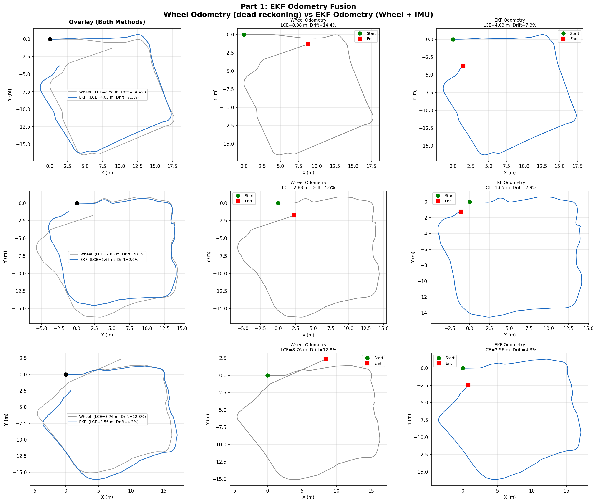
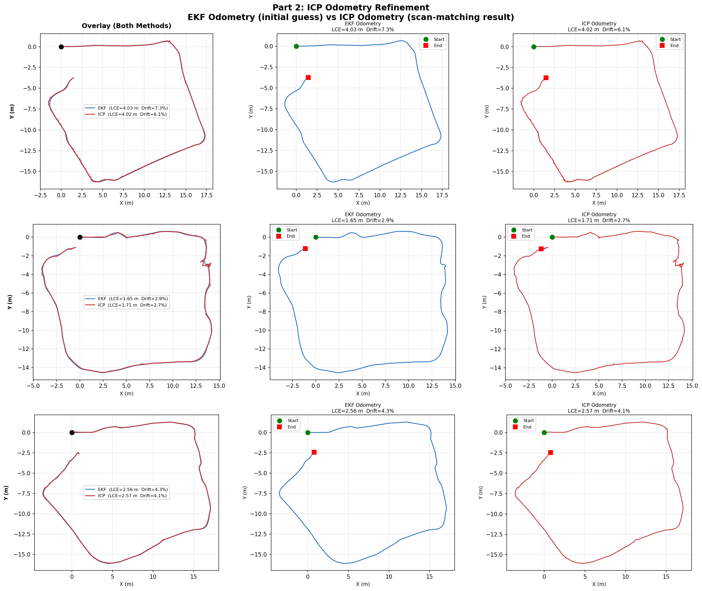
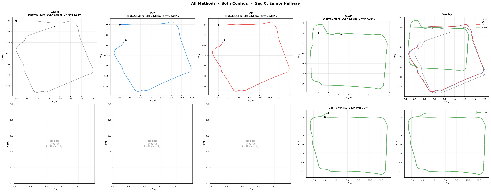
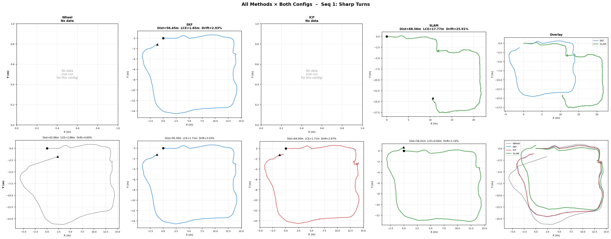
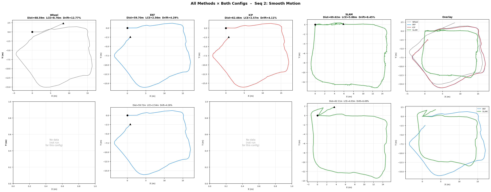

# FRA532 Mobile Robotics – Lab 1: EKF / ICP / SLAM

**Student:** Bhumipat Ngamphueak
**ID:** 66340500043
**Course:** FRA532 Mobile Robotics
**Lab:** Lab 1 – EKF Odometry Fusion, ICP Refinement, and Full SLAM

---

## Table of Contents

1. [Setup](#1-setup)
2. [What We Do](#2-what-we-do)
   - [Differential Drive Model & Wheel Odometry](#21-differential-drive-model--wheel-odometry)
   - [Extended Kalman Filter (EKF)](#22-extended-kalman-filter-ekf)
   - [ICP Odometry Refinement](#23-icp-odometry-refinement)
   - [SLAM with slam_toolbox](#24-slam-with-slam_toolbox)
3. [Results](#3-results)
   - [Configuration Definition](#31-configuration-definition)
   - [Trajectory Plots](#32-trajectory-plots)
   - [Generated Maps](#33-generated-maps)
   - [Quantitative Metrics](#34-quantitative-metrics)
   - [Discussion](#35-discussion)

---

## 1. Setup

### Prerequisites

- Ubuntu 22.04
- ROS 2 Humble ([official install guide](https://docs.ros.org/en/humble/Installation.html))
- Python 3.10+
- TurtleBot3 Burger

### Installation

**1. Clone the Repository**
```bash
git clone https://github.com/BhumipatNgamphueak/Mobile_Robot.git -b Lab1
cd ~/Mobile_Robot
```

**2. Install ROS 2 Dependencies**
```bash
sudo apt update
sudo apt install -y ros-humble-slam-toolbox ros-humble-nav2-map-server
rosdep install --from-paths src --ignore-src -r -y
```

**3. Install Python Dependencies**
```bash
pip3 install numpy scipy pandas matplotlib pillow pyyaml
```

**4. Place the Dataset**

Download the FRA532 Lab 1 dataset and place it under `src/FRA532_LAB1_DATASET/`:
```
src/FRA532_LAB1_DATASET/
├── fibo_floor3_seq00/
│   └── fibo_floor3_seq00_0.db3
├── fibo_floor3_seq01/
│   └── fibo_floor3_seq01_0.db3
└── fibo_floor3_seq02/
    └── fibo_floor3_seq02_0.db3
```

**5. Build the Workspace**
```bash
cd ~/Mobile_Robot
colcon build --symlink-install
```

**6. Source the Environment**
```bash
source install/setup.bash
```

**7. (Optional) Add to `.bashrc`**
```bash
echo "source ~/Mobile_Robot/install/setup.bash" >> ~/.bashrc
source ~/.bashrc
```

### Running the Experiments

You need **two terminals** for each part.

**Part 1 – EKF Odometry Fusion**
```bash
# Terminal 1
cd ~/Mobile_Robot && source install/setup.bash
ros2 launch ekf_filter part1_ekf_fusion.launch.py
```
Outputs saved to `results/`: `wheel_odometry.csv`, `ekf_odometry.csv`, `imu_data.csv`

**Part 2 – ICP Odometry Refinement**
```bash
# Terminal 1
cd ~/Mobile_Robot && source install/setup.bash
ros2 launch ekf_filter part2_icp_refinement.launch.py
```
Outputs saved to `results/`: `icp_odometry.csv`, `icp_map.pgm`, `icp_map.yaml`

**Part 3 – Full SLAM**
```bash
# Terminal 1 – without visualization
cd ~/Mobile_Robot && source install/setup.bash
ros2 launch ekf_filter part3_slam.launch.py

# Terminal 1 – with RViz2
cd ~/Mobile_Robot && source install/setup.bash
ros2 launch ekf_filter part3_slam_with_rviz.launch.py
```
Outputs saved to `results/`: `slam_trajectory.csv`, `slam_map.pgm`, `slam_map.yaml`

**Generate All Comparison Plots**
```bash
cd ~/Mobile_Robot
python3 scripts/plot_all_results.py
```

> **Switching datasets:** To use a different sequence, pass the `bag_path` parameter:
> ```bash
> ros2 launch ekf_filter part1_ekf_fusion.launch.py \
>     bag_path:=$HOME/Mobile_Robot/src/FRA532_LAB1_DATASET/fibo_floor3_seq01/fibo_floor3_seq01_0.db3
> ```

### Repository Structure

```
Mobile_Robot/
├── src/
│   ├── FRA532_LAB1_DATASET/               # Dataset rosbags (not tracked by git)
│   │   ├── fibo_floor3_seq00/
│   │   ├── fibo_floor3_seq01/
│   │   └── fibo_floor3_seq02/
│   ├── differential_drive_model/
│   │   └── scripts/
│   │       ├── read_data_node.py          # Rosbag replay + timestamp re-sync
│   │       └── wheel_odometry_node.py     # Dead-reckoning from wheel encoders
│   └── ekf_filter/
│       ├── config/
│       │   ├── mapper_params_online_async_B.yaml    # SLAM Config B (strict, active)
│       │   └── mapper_params_online_async_saved_not_use.yaml  # SLAM Config A (relaxed)
│       ├── launch/
│       │   ├── part1_ekf_fusion.launch.py
│       │   ├── part2_icp_refinement.launch.py
│       │   ├── part3_slam.launch.py
│       │   └── part3_slam_with_rviz.launch.py
│       └── scripts/
│           ├── part1/
│           │   ├── ekf_odometry_node.py   # 5-state EKF (wheel + IMU fusion)
│           │   └── wheel_odometry_node.py
│           ├── part2/
│           │   └── icp_odometry_node.py   # ICP scan matching + adaptive blending
│           ├── part3/
│           │   └── scan_republisher_node.py
│           ├── auto_map_saver_node.py
│           ├── icp_map_builder_node.py
│           ├── slam_trajectory_saver_node.py
│           └── read_data_node.py
├── scripts/
│   ├── plot_all_results.py                # All trajectory plots + metrics
│   ├── plot_parts.py                      # Part 1 and Part 2 focused comparisons
│   ├── plot_icp_vs_slam_maps.py           # ICP map vs SLAM map comparisons
│   └── plot_compare_drift.py              # compare_drift run analysis
└── results/                               # All output files (auto-created)
    ├── sequence_0/Config_A/ and Config_B/
    ├── sequence_1/Config_A/ and Config_B/
    └── sequence_2/Config_A/ and Config_B/
```

---

## 2. What We Do

This lab implements a 2D localization pipeline with four progressive methods, each adding more sensor information and algorithmic sophistication.

| Part | Method | Sensors |
|------|--------|---------|
| 1 | Wheel Odometry (baseline) | `/joint_states` |
| 1 | EKF Odometry Fusion | `/joint_states` + `/imu` |
| 2 | ICP Odometry Refinement | `/scan` (EKF as initial guess) |
| 3 | Full SLAM | `/scan` + EKF odometry |

---

### 2.1 Differential Drive Model & Wheel Odometry

The baseline method integrates wheel encoder ticks using the differential-drive kinematic model.

**Robot geometry (TurtleBot3 Burger):**

| Parameter | Value |
|-----------|-------|
| Wheel radius (`r`) | 0.033 m |
| Wheel separation (`L`) | 0.160 m |

**Velocity computation from encoder ticks:**
```
v     = r/2 * (dφ_R + dφ_L) / dt
omega = r/L * (dφ_R - dφ_L) / dt
```

**Dead-reckoning integration** (Euler, 20 Hz):
```
x_new = x + v·cos(θ)·dt
y_new = y + v·sin(θ)·dt
θ_new = θ + omega·dt
```

This accumulates unbounded error over time, especially in heading, because wheel slip and small calibration errors in `r` and `L` are never corrected.

---

### 2.2 Extended Kalman Filter (EKF)

The EKF fuses wheel encoder data with the IMU to reduce drift, particularly heading drift from the gyroscope.

**State vector:** `[x, y, θ, v, ω]` — position, heading, linear velocity, angular velocity

#### Prediction Step (20 Hz, from `/joint_states`)

For curved motion (`|ω| > 1×10⁻⁶ rad/s`):
```
x_new = x + (v/ω)(sin(θ + ω·dt) − sin(θ))
y_new = y + (v/ω)(−cos(θ + ω·dt) + cos(θ))
θ_new = θ + ω·dt
```

For straight-line motion (`ω ≈ 0`):
```
x_new = x + v·cos(θ)·dt
y_new = y + v·sin(θ)·dt
θ_new = θ
```

Covariance prediction: `P_pred = F·P·Fᵀ + Q`
where `F` is the analytically-derived Jacobian of the motion model.

#### Measurement Updates (20 Hz, from `/imu`)

Three independent updates are applied per IMU callback:

1. **Gyroscope update** — directly measures `ω`
   `H = [0, 0, 0, 0, 1]` → updates `state[4]`

2. **Accelerometer update** — integrates `a_x` to refine `v`
   Applied only when `|a_x| > 0.05 m/s²` (ignores noise when nearly still)
   `H = [0, 0, 0, 1, 0]` → updates `state[3]`

3. **Centripetal acceleration update** — uses `a_y ≈ v·ω` to refine `ω` during turns
   Applied only when `|v| > 0.05 m/s` and `|a_y| > 0.02 m/s²`
   `H = [0, 0, 0, 0, 1]` → updates `state[4]`

**Wheel encoder update** (per `/joint_states` callback):
Computes `[v_odom, ω_odom]` and updates `state[3:5]`.

#### Outlier Rejection

Mahalanobis distance gating applied to every update:
`d² = (z − Hx)ᵀ (H·P·Hᵀ + R)⁻¹ (z − Hx)`
Measurements with `d² > threshold` are silently rejected.

#### IMU Bias Calibration

The first 75 IMU samples (while the robot is stationary) are averaged to estimate and remove accelerometer bias (`bias_x`, `bias_y`).

#### EKF Hyperparameters

| Parameter | Value | Description |
|-----------|-------|-------------|
| `Q` | diag([0.01]×5) | Process noise covariance |
| `R_imu_gyro` | 0.0030 (rad/s)² | Gyroscope noise |
| `R_imu_accel` | 0.1907 (m/s²)² | Accelerometer noise |
| `R_odom` | diag([0.0005, 0.0031]) | Wheel odometry noise [v, ω] |
| `R_centripetal` | 2.0 (rad/s)² | Centripetal ω estimate noise |
| Bias calibration | 75 samples | Stationary IMU samples for bias estimation |
| TF publish rate | 50 Hz | Prevents RViz transform extrapolation |

---

### 2.3 ICP Odometry Refinement

ICP matches consecutive LiDAR scans to estimate the incremental transform and integrates it into a global pose. The EKF delta is used only as the **initial guess** for ICP (not directly in the output).

#### Algorithm (per scan, 5 Hz)

1. Convert `LaserScan` to 2D point cloud (range filter: `range_min < r < range_max`)
2. Use EKF delta `[dx, dy, dθ]` as the initial transform
3. **ICP loop** (max 200 iterations, tolerance 1×10⁻⁵):
   - Build KD-tree on target scan
   - Find nearest-neighbor correspondences (distance < 1.2 m)
   - Reject outlier pairs
   - Compute optimal rotation `R` via SVD on cross-covariance: `H = src_c.T · tgt_c`
   - Extract translation: `t = tgt_mean − R·src_mean`
   - Update accumulated transform; check convergence
4. **Adaptive blending** of ICP result with EKF initial guess:
   - Quality score = `n_correspondences / max_correspondences × (1 − normalized_error)`
   - High quality → low EKF trust (min 5%)
   - Low quality → high EKF trust (max 35%)
   - Rotation gets extra +10% EKF trust (IMU gyro is more reliable than scan matching for heading)
   - If ICP diverges or has < 20 correspondences → use EKF 100%
5. Integrate final `[dx, dy, dθ]` into global pose

#### ICP Hyperparameters

| Parameter | Value | Description |
|-----------|-------|-------------|
| `max_iterations` | 200 | Maximum ICP iterations per scan |
| `tolerance` | 1×10⁻⁵ | Convergence threshold (mean error change) |
| `max_correspondence_dist` | 1.2 m | Maximum point-pair distance for matching |
| `min_ekf_trust` | 5% | EKF weight at highest ICP quality |
| `max_ekf_trust` | 35% | EKF weight at lowest ICP quality |
| `rotation_ekf_bonus` | +10% | Extra EKF trust for heading (gyro is accurate) |
| `min_correspondences` | 20 | Minimum matches; below this use EKF 100% |

---

### 2.4 SLAM with slam_toolbox

Full SLAM uses `async_slam_toolbox_node` with EKF odometry as the odometry input and `/scan` as the laser source.

**Key features:**
- Scan-to-map matching at every pose (`use_scan_matching: true`)
- Pose graph optimization with loop closure (`do_loop_closing: true`)
- Ceres non-linear solver: `SPARSE_NORMAL_CHOLESKY` + `SCHUR_JACOBI` + `LEVENBERG_MARQUARDT`
- EKF odometry as the odometry source (high quality input)

#### SLAM Configurations

Two configurations were tested to study the effect of scan-matching search constraints:

| Parameter | Config A (Relaxed) | Config B (Strict) |
|-----------|-------------------|-------------------|
| `correlation_search_space_dimension` | 0.3 m (±15 cm) | 0.03 m (±1.5 cm) |
| `distance_variance_penalty` | 2.5 | **20.0** |
| `angle_variance_penalty` | 2.5 | **40.0** |
| `loop_match_minimum_response_fine` | 0.5 | 0.5 |
| `link_match_minimum_response_fine` | 0.3 | 0.3 |
| `resolution` | 0.05 m/px | 0.05 m/px |
| `max_laser_range` | 3.5 m | 3.5 m |
| `minimum_travel_distance` | 0.2 m | 0.2 m |

**Config A (Relaxed):** Allows the scan matcher to search a wide area (±15 cm). This can find better scan matches in open environments but is prone to false correspondences in symmetric corridor geometry (both walls look identical).

**Config B (Strict):** Constrains the search space to ±1.5 cm and applies strong variance penalties to force SLAM to closely follow EKF odometry. The high `distance_variance_penalty=20` and `angle_variance_penalty=40` prevent the pose graph from diverging from the EKF estimate, making SLAM more robust to corridor ambiguity.

> **Active configuration:** `Part 3` launch files use **Config B** (`mapper_params_online_async_B.yaml`).

---

## 3. Results

### Configuration Definition

The table below defines which SLAM configuration was used for each sequence and method.

| Sequence | Rosbag file | Wheel / EKF / ICP run | SLAM runs |
|----------|------------|----------------------|-----------|
| Sequence 0 | `fibo_floor3_seq00_0.db3` | Config A | **Both A and B** |
| Sequence 1 | `fibo_floor3_seq01_0.db3` | Config B | **Both A and B** |
| Sequence 2 | `fibo_floor3_seq02_0.db3` | Config A | **Both A and B** |

> Wheel, EKF, and ICP are pure odometry methods and do not depend on the SLAM config. SLAM was run independently with both configurations on all three sequences.

**Metric definitions used throughout:**
- **LCE** = Loop Closure Error (Euclidean distance start→end). Lower = better.
- **Drift Rate** = `LCE / Total Distance × 100%`. Lower = better.

---

### 3.1 Part 1 – EKF Odometry Fusion

#### Objective
Implement an Extended Kalman Filter (EKF) to fuse wheel odometry and IMU measurements, obtaining a filtered and more reliable odometry estimate compared to raw wheel odometry.

#### Description
Wheel odometry is computed from `/joint_states` and fused with IMU measurements from `/imu` using the EKF. The filter estimates robot pose by combining a differential-drive motion model with probabilistic sensor updates (gyroscope, accelerometer, and centripetal acceleration). The result is compared against the baseline dead-reckoning trajectory.

#### Trajectory Comparison: Wheel Odometry vs EKF Odometry

Each row is one sequence. Left column shows both methods overlaid; middle and right columns show each method individually with its LCE and drift rate.



#### Part 1 Quantitative Results

| Sequence | Method | Total Dist (m) | LCE (m) | Drift Rate (%) |
|----------|--------|---------------|---------|---------------|
| Seq 0 | Wheel Odometry | 61.82 | 8.877 | 14.36 |
| Seq 0 | **EKF Odometry** | 55.43 | **4.033** | **7.28** |
| Seq 1 | Wheel Odometry | 62.69 | 2.882 | 4.60 |
| Seq 1 | **EKF Odometry** | 56.39 | **1.711** | **3.03** |
| Seq 2 | Wheel Odometry | 68.59 | 8.761 | 12.77 |
| Seq 2 | **EKF Odometry** | 59.70 | **2.562** | **4.29** |

#### Observations
- EKF reduces drift rate by an average of **−54%** across all three sequences.
- The largest improvement is on Seq 0 (−49%) and Seq 2 (−66%), both long traversals where heading error dominates.
- The gyroscope update is the single most impactful correction — heading drift is the primary failure mode of dead-reckoning.
- Even with IMU fusion, EKF still accumulates drift because it has no absolute position reference.

---

### 3.2 Part 2 – ICP Odometry Refinement

#### Objective
Refine the EKF-based odometry using LiDAR scan matching (ICP) and evaluate the improvement in accuracy and drift compared to EKF alone.

#### Description
The EKF odometry from Part 1 is used as the initial guess for ICP scan matching on consecutive `/scan` messages. At each scan (5 Hz), ICP finds the optimal rigid transform between the current and previous scan. The result is blended adaptively with the EKF initial guess (5–35% EKF trust) and integrated to produce a LiDAR-based odometry estimate. ICP additionally builds a 2D occupancy map by projecting scans from the estimated poses.

#### Trajectory Comparison: EKF vs ICP Odometry

Each row is one sequence. Left column shows both methods overlaid; middle and right show each individually.



#### 2D Occupancy Maps from ICP

The ICP node projects LiDAR scans at each estimated pose to build an occupancy grid. Map quality directly reflects positional accuracy.

| Sequence 0 | Sequence 1 | Sequence 2 |
|:----------:|:----------:|:----------:|
|  |  |  |

#### Part 2 Quantitative Results

| Sequence | Method | Total Dist (m) | LCE (m) | Drift Rate (%) |
|----------|--------|---------------|---------|---------------|
| Seq 0 | EKF Odometry | 55.43 | 4.033 | 7.28 |
| Seq 0 | **ICP Odometry** | 66.11 | **4.025** | **6.09** |
| Seq 1 | EKF Odometry | 56.39 | 1.711 | 3.03 |
| Seq 1 | **ICP Odometry** | 64.00 | **1.709** | **2.67** |
| Seq 2 | EKF Odometry | 59.70 | 2.562 | 4.29 |
| Seq 2 | **ICP Odometry** | 62.46 | **2.567** | **4.11** |

#### Observations
- ICP improves drift rate by an average of **−10.8%** over EKF.
- The improvement comes from 5 Hz scan matching that catches positional errors not corrected by the IMU alone.
- Adaptive blending (falling back to EKF when scan quality is low) prevents degradation in featureless corridor sections where ICP would otherwise diverge.
- ICP total distance is slightly higher than EKF because scan matching introduces small jitter on straight paths.
- ICP uniquely produces a 2D occupancy map alongside the trajectory.

---

### 3.3 Part 3 – Full SLAM with slam_toolbox

#### Objective
Perform full SLAM using `slam_toolbox` and compare its pose estimation and mapping performance with the ICP-based odometry from Part 2.

#### Description
`slam_toolbox` runs in async mode using `/scan` as laser input and EKF odometry (`/ekf/odometry`) as the odometry source. It builds a pose graph and applies Ceres non-linear optimization with loop closure to produce a globally consistent trajectory and map. Two configurations are tested to study the effect of scan-matching constraints on corridor environments.

#### Config A (Relaxed) vs Config B (Strict) – SLAM Trajectory

**Sequence 0 – Empty Hallway**



**Sequence 1 – Sharp Turns**



**Sequence 2 – Smooth Motion**



**All sequences overview:**


**Config A vs Config B – side-by-side summary:**


#### 2D Occupancy Maps: ICP vs SLAM Config A vs SLAM Config B

**Sequence 0 – Empty Hallway**


**Sequence 1 – Sharp Turns**


**Sequence 2 – Smooth Motion**


**All sequences map grid (ICP | SLAM-A | SLAM-B):**


#### Compare-Drift Run (Sequence 0 – All 4 Methods on Identical Data)

The `results/sequence_0/compare_drift/` folder contains a dedicated run with all four methods active simultaneously, providing a direct apples-to-apples comparison. Both an ICP map and SLAM map were saved from this session.

**ICP Map vs SLAM Map:**


**All 4 method trajectories:**


**All 4 trajectories overlaid on occupancy maps:**


#### Part 3 Quantitative Results

| Sequence | Method | Total Dist (m) | LCE (m) | Drift Rate (%) |
|----------|--------|---------------|---------|---------------|
| Seq 0 | ICP Odometry (Part 2 ref.) | 66.11 | 4.025 | 6.09 |
| Seq 0 | SLAM Config A | 62.05 | 4.567 | 7.36 |
| Seq 0 | **SLAM Config B** | 55.74 | **1.216** | **2.18** |
| Seq 1 | ICP Odometry (Part 2 ref.) | 64.00 | 1.709 | 2.67 |
| Seq 1 | SLAM Config A | 68.56 | 17.766 | 25.91 |
| Seq 1 | **SLAM Config B** | 56.41 | **0.643** | **1.14** |
| Seq 2 | ICP Odometry (Part 2 ref.) | 62.46 | 2.567 | 4.11 |
| Seq 2 | SLAM Config A | 69.62 | 5.883 | 8.45 |
| Seq 2 | **SLAM Config B** | 62.11 | **4.033** | **6.49** |

#### Observations
- **Config B (Strict) consistently outperforms Config A** in all three sequences.
- The most dramatic difference is Sequence 1: Config A drifts 25.91% (LCE = 17.77 m) while Config B achieves only 1.14% (LCE = 0.64 m). The relaxed ±15 cm search space causes false scan correspondences in the symmetric left/right corridor walls.
- Config B forces SLAM to stay close to EKF via high variance penalties (`distance=20`, `angle=40`), effectively using EKF as a strong prior and only refining with scan matching.
- Loop closure in Config B further removes accumulated drift when the robot revisits mapped areas.
- SLAM Config B produces the sharpest occupancy maps — walls are clean and consistent, reflecting accurate pose estimates throughout the run.

| Map Quality | ICP | SLAM Config A | SLAM Config B |
|-------------|-----|--------------|--------------|
| Seq 0 | Clear walls, slight blur | Blurry from drift | Sharp, clean walls |
| Seq 1 | Turn artifacts | **Badly distorted** | Best quality |
| Seq 2 | Smooth corridors | Moderate | Good quality |

---

### 3.4 Overall Comparison

#### Full Results Table (All Methods, All Sequences)

| Method | Config | Seq | Total Dist (m) | LCE (m) | Drift Rate (%) |
|--------|--------|-----|---------------|---------|---------------|
| Wheel  | A | 0 | 61.82 | 8.877 | 14.36 |
| EKF    | A | 0 | 55.43 | 4.033 |  7.28 |
| ICP    | A | 0 | 66.11 | 4.025 |  6.09 |
| SLAM   | A | 0 | 62.05 | 4.567 |  7.36 |
| SLAM   | **B** | 0 | 55.74 | **1.216** | **2.18** |
| Wheel  | B | 1 | 62.69 | 2.882 |  4.60 |
| EKF    | B | 1 | 56.39 | 1.711 |  3.03 |
| ICP    | B | 1 | 64.00 | 1.709 |  2.67 |
| SLAM   | A | 1 | 68.56 | 17.766 | 25.91 |
| SLAM   | **B** | 1 | 56.41 | **0.643** | **1.14** |
| Wheel  | A | 2 | 68.59 | 8.761 | 12.77 |
| EKF    | A | 2 | 59.70 | 2.562 |  4.29 |
| ICP    | A | 2 | 62.46 | 2.567 |  4.11 |
| SLAM   | A | 2 | 69.62 | 5.883 |  8.45 |
| SLAM   | **B** | 2 | 62.11 | **4.033** | **6.49** |

#### Average Drift Rate Summary

| Method | Avg Drift Rate | vs Wheel |
|--------|---------------|---------|
| Wheel Odometry | 10.58% | baseline |
| EKF Odometry | 4.87% | **−54%** |
| ICP Odometry | 4.29% | **−59%** |
| SLAM Config A | 13.91% | worse (fails Seq 1) |
| SLAM Config B | **3.27%** | **−69%** |

#### Ranking: SLAM Config B > ICP ≈ EKF > Wheel > SLAM Config A (Seq 1)

#### Robustness Comparison

| Method | Computation | Slip Robustness | Feature Dependency | Long-term Stability |
|--------|-------------|-----------------|-------------------|---------------------|
| Wheel Odometry | Very Fast | Poor | None | Poor |
| EKF Odometry | Fast | Moderate | None | Fair |
| ICP Odometry | Medium | Good | High | Fair |
| SLAM Config A | Slow | Good | High | Variable |
| SLAM Config B | Slow | Good | High | **Excellent** |

#### Key Findings

1. **EKF (Part 1) reduces drift by ~54% vs wheel-only.** The gyroscope update corrects heading drift, which is the dominant error source in dead-reckoning.
2. **ICP (Part 2) further reduces drift by ~11% vs EKF.** Adaptive blending prevents degradation in featureless sections while scan matching catches slip the IMU misses.
3. **SLAM Config B (Part 3) achieves the best overall accuracy (avg 3.27% drift).** Strict constraints keep the pose graph close to EKF, preventing corridor ambiguity. Loop closure provides global consistency.
4. **SLAM Config A is unreliable.** A wide search space (±15 cm) causes catastrophic failure on Seq 1 (25.91% drift). Config B is the recommended configuration for symmetric indoor corridors.
5. **Only SLAM produces a globally consistent 2D map**, making it uniquely suitable for autonomous navigation tasks beyond localization.

---

*Last updated: February 2026*
