[](https://classroom.github.com/a/Mnj7rZ_g)

# LAB 2: Quadrotor UAV Control — MPC Hover and Trajectory Tracking

> **Group size:** 2–3 students

---

## Table of Contents

1. [Overview](#1-overview)
2. [System Architecture](#2-system-architecture)
3. [Kinematics and Dynamics](#3-kinematics-and-dynamics)
4. [Controller Design](#4-controller-design)
5. [State Estimation](#5-state-estimation)
6. [Trajectory Design](#6-trajectory-design)
7. [Experimental Setup](#7-experimental-setup)
8. [Results](#8-results)
9. [Discussion and Analysis](#9-discussion-and-analysis)
10. [References](#10-references)

---

## 1. Overview

This laboratory implements a **Model Predictive Controller (MPC)** for a simulated quadrotor UAV to achieve stable hover and trajectory tracking in both disturbance-free and wind-disturbed environments. The simulation is built on **ROS 2** with **Ignition Gazebo Fortress (6.17.0)**, using the `quad_description` package to provide the physical robot model and world definitions.

The controller is designed as a **linearised unconstrained batch-form MPC** operating at 50 Hz. It stabilises the drone at a 1.0 m hover setpoint and subsequently tracks a series of 2D and 3D reference trajectories. An **Extended Kalman Filter (EKF)** runs at 100 Hz to fuse IMU and odometry measurements into a clean 12-state estimate consumed by the MPC.

Wind disturbance rejection is achieved through an **integral action** term appended to the MPC output, which eliminates the steady-state position offset caused by the constant 4 m/s wind load defined in `wind.sdf`.

### Objectives

| Part | Task | Environments |
|------|------|-------------|
| 1 | Stable hover at $z = 1.0$ m | No wind · Wind |
| 2 | 2D trajectory tracking (x-z plane) | No wind · Wind |
| 3 | 3D trajectory tracking | No wind · Wind |

### Software Stack

| Component | Version / Package |
|-----------|------------------|
| ROS 2 | Humble |
| Gazebo | Ignition Fortress 6.17.0 |
| Robot description | `quad_description` |
| Controller & EKF | `quad_controller` (this package) |
| State estimation | Custom EKF node |
| Bridge | `ros_gz_bridge` |

---

## 2. System Architecture

### 2.1 ROS 2 Node Graph

```
                     ┌─────────────────────────────────────┐
                     │           Ignition Gazebo            │
                     │  ┌──────────┐   ┌─────────────────┐ │
                     │  │  World   │   │   Quadrotor      │ │
                     │  │  (SDF)   │   │  (URDF/xacro)   │ │
                     └──┴──────────┴───┴────────┬────────┴─┘
                                                 │
                        /imu  (BEST_EFFORT)       │  /odom  (BEST_EFFORT)
                        ◄────────────────────────┘────────────────────────
                        │                                                  │
                ┌───────▼──────────────────────────────────────────────────▼───┐
                │                      ekf_node  (100 Hz)                      │
                │         Extended Kalman Filter — fuses IMU + odometry         │
                └───────────────────────┬──────────────────────────────────────┘
                                        │  /state_estimate  (RELIABLE)
                ┌───────────────────────▼──────────────────────────────────────┐
                │                   mpc_controller  (50 Hz)                    │
                │    Linearised MPC + Motor Allocation + Integral Action        │
                │    ┌──────────────────────────────────────────────────────┐  │
                │    │  /reference_state ◄── trajectory_generator  (50 Hz) │  │
                │    └──────────────────────────────────────────────────────┘  │
                └──────┬────────────────────────────┬─────────────────────────┘
                       │  /motor_commands            │  /mpc_debug
                       │  /control_wrench            │  /actual_path
                       ▼                             ▼
                   Gazebo Motors              data_collector
```

### 2.2 Topic Summary

| Topic | Message Type | QoS | Description |
|-------|-------------|-----|-------------|
| `/imu` | `sensor_msgs/Imu` | BEST_EFFORT | Raw accelerometer + gyroscope at ~400 Hz |
| `/odom` | `nav_msgs/Odometry` | BEST_EFFORT | Gazebo ground-truth pose at ~100 Hz |
| `/state_estimate` | `nav_msgs/Odometry` | RELIABLE | EKF 12-state output at 100 Hz |
| `/reference_state` | `std_msgs/Float64MultiArray` | RELIABLE | 12-state trajectory reference at 50 Hz |
| `/control_wrench` | `std_msgs/Float64MultiArray` | RELIABLE | Total wrench $[T,\tau_\phi,\tau_\theta,\tau_\psi]$ at 50 Hz |
| `/motor_commands` | `actuator_msgs/Actuators` | RELIABLE | Rotor speeds $[\omega_0,\omega_1,\omega_2,\omega_3]$ at 50 Hz |
| `/mpc_debug` | `std_msgs/Float64MultiArray` | RELIABLE | 19-field MPC internal telemetry at 50 Hz |

### 2.3 Package Structure

```
quad_controller/
├── config/
│   └── params.yaml          # All tunable parameters (gains, physical model)
├── launch/
│   └── controller.launch.py # Launches EKF + MPC + trajectory + data collector
├── scripts/
│   ├── ekf_node.py          # Extended Kalman Filter state estimator
│   ├── mpc_controller.py    # Linearised MPC with motor allocation
│   ├── trajectory_generator.py  # Reference trajectory publisher
│   └── data_collector.py    # Passive observer — CSVs + plots on shutdown
```

---

## 3. Kinematics and Dynamics

### 3.1 Reference Frames

Two frames are used throughout:

- **World frame** $\{W\}$: inertial, East-North-Up (ENU), fixed to the Gazebo origin.
- **Body frame** $\{B\}$: attached to the centre of mass of the quadrotor, $z$-axis pointing upward through the propeller disc plane.

### 3.2 State Vector

The 12-dimensional state vector is defined as:

$$\mathbf{x} = \begin{bmatrix} x & y & z & \phi & \theta & \psi & \dot{x} & \dot{y} & \dot{z} & p & q & r \end{bmatrix}^\top \in \mathbb{R}^{12}$$

where $(x, y, z)$ is the position in $\{W\}$, $(\phi, \theta, \psi)$ are the **ZXY Euler angles** (roll, pitch, yaw), $(\dot{x}, \dot{y}, \dot{z})$ are linear velocities in $\{W\}$, and $(p, q, r)$ are body-frame angular rates.

**ZXY convention:** The rotation matrix from body to world is $R = R_z(\psi)\,R_x(\phi)\,R_y(\theta)$, which yields the parametrisation used by `scipy.spatial.transform.Rotation.as_euler('zxy')`.

### 3.3 Rigid Body Dynamics

Applying Newton-Euler equations to the quadrotor:

**Translational dynamics (world frame):**

$$m\ddot{\mathbf{p}} = R\,\mathbf{f}_B - m g\,\hat{z}_W$$

where $\mathbf{f}_B = [0, 0, T]^\top$ is the total thrust in the body frame and $T = \sum_{i=0}^{3} T_i$.

**Rotational dynamics (body frame):**

$$\mathbf{I}\,\dot{\boldsymbol{\omega}} = \boldsymbol{\tau} - \boldsymbol{\omega} \times \mathbf{I}\boldsymbol{\omega}$$

where $\mathbf{I} = \text{diag}(I_{xx}, I_{yy}, I_{zz})$ is the inertia tensor and $\boldsymbol{\tau} = [\tau_\phi, \tau_\theta, \tau_\psi]^\top$ is the body torque.

### 3.4 Motor Model

Each rotor $i$ produces:

$$T_i = k_F \omega_i^2, \qquad \tau_{d,i} = -d_i \, k_F \, k_M \, \omega_i^2$$

where $k_F = 8.549 \times 10^{-6}\ \text{N/(rad/s)}^2$ is the thrust coefficient, $k_M = 0.06$ is the dimensionless moment-to-thrust ratio (Gazebo `momentConstant`), and $d_i \in \{+1, -1\}$ is the spinning direction (CCW = $+1$, CW = $-1$).

The effective yaw coefficient is $\kappa = k_F k_M = 5.129 \times 10^{-7}\ \text{N}{\cdot}\text{m/(rad/s)}^2$.

### 3.5 Motor Layout and Allocation Matrix

Rotor positions and directions (from `quadrotor_base.xacro`):

| Rotor | Position $(r_x, r_y)$ [m] | Direction $d_i$ |
|-------|--------------------------|----------------|
| 0 (front-right) | $(+0.13,\ -0.22)$ | CCW ($+1$) |
| 1 (rear-left)   | $(-0.13,\ +0.20)$ | CCW ($+1$) |
| 2 (front-left)  | $(+0.13,\ +0.22)$ | CW  ($-1$) |
| 3 (rear-right)  | $(-0.13,\ -0.20)$ | CW  ($-1$) |

The wrench is related to squared rotor speeds by:

$$
\begin{bmatrix} T \\\\ \tau_\phi \\\\ \tau_\theta \\\\ \tau_\psi \end{bmatrix} = \underbrace{\begin{bmatrix} k_F & k_F & k_F & k_F \\\\ k_F r_{y,0} & k_F r_{y,1} & k_F r_{y,2} & k_F r_{y,3} \\\\ -k_F r_{x,0} & -k_F r_{x,1} & -k_F r_{x,2} & -k_F r_{x,3} \\\\ -d_0\kappa & -d_1\kappa & -d_2\kappa & -d_3\kappa \end{bmatrix}}_{\mathbf{A}} \begin{bmatrix} \omega_0^2 \\\\ \omega_1^2 \\\\ \omega_2^2 \\\\ \omega_3^2 \end{bmatrix}
$$

Motor speeds are recovered by $\boldsymbol{\omega}^2 = \mathbf{A}^{-1} \mathbf{u}$, where $\mathbf{u} = [T, \tau_\phi, \tau_\theta, \tau_\psi]^\top$.

### 3.6 Linearisation around Hover

At the hover equilibrium $\mathbf{x}_0 = \mathbf{0}_{12}$, $\mathbf{u}_0 = [mg, 0, 0, 0]^\top$, and under the small-angle assumption ($|\phi|, |\theta| \ll 1$), the nonlinear dynamics reduce to the continuous LTI system $\dot{\mathbf{x}} = A_c\,\mathbf{x} + B_c\,\mathbf{u}$:

$$
A_c = \begin{bmatrix} \mathbf{0}_3 & \mathbf{0}_3 & I_3 & \mathbf{0}_3 \\\\ \mathbf{0}_3 & \mathbf{0}_3 & \mathbf{0}_3 & I_3 \\\\ \mathbf{0}_{3\times3}^* & \mathbf{0}_3 & \mathbf{0}_3 & \mathbf{0}_3 \\\\ \mathbf{0}_3 & \mathbf{0}_3 & \mathbf{0}_3 & \mathbf{0}_3 \end{bmatrix}, \quad B_c = \begin{bmatrix} \mathbf{0}_{6\times4} \\\\ B_{\text{acc}} \end{bmatrix}
$$

The non-zero coupling entries in $A_c$ are:

$$\ddot{x} \approx g\,\theta, \qquad \ddot{y} \approx -g\,\phi$$

and $B_{\text{acc}} = \text{diag}(0, 0, 1/m, 1/I_{xx}, 1/I_{yy}, 1/I_{zz})$ (rows 7–12, columns $T, \tau_\phi, \tau_\theta, \tau_\psi$).

The system is discretised at $\Delta t = 0.02$ s using zero-order hold (ZOH):

$$\mathbf{x}_{k+1} = A_d\,\mathbf{x}_k + B_d\,\mathbf{u}_k$$

### 3.7 Assumptions

The following assumptions are made throughout this laboratory:

1. **Rigid body:** The quadrotor frame is perfectly rigid with no structural flexibility.
2. **Small angles:** The linearisation is valid only when $|\phi| < 15°$ and $|\theta| < 15°$. Violations degrade MPC performance.
3. **Quadratic thrust law:** Each rotor produces thrust strictly proportional to $\omega_i^2$ with no motor dynamics or delays.
4. **No body aerodynamic drag:** Translational drag on the airframe is neglected. Only rotor thrust and gravity act on the centre of mass.
5. **Constant wind:** In the wind experiment, the disturbance is a constant body-level force (Gazebo `WindEffects` plugin, 4 m/s in the $-y$ direction). Wind gusts and turbulence are not modelled.
6. **Decoupled yaw:** Yaw dynamics are controlled independently; MPC reference yaw is fixed at zero during all trajectory experiments to keep the linearisation valid.
7. **Inertia tensor is diagonal:** Off-diagonal products of inertia are assumed negligible.

---

## 4. Controller Design

### 4.1 MPC Problem Formulation

The MPC minimises a finite-horizon quadratic cost over a prediction horizon $N = 20$ steps at $\Delta t = 0.02$ s (0.4 s lookahead):

$$\min_{\mathbf{U}} \quad J = \sum_{k=0}^{N-1} \left[ (\mathbf{x}_k - \mathbf{x}_{\text{ref}})^\top Q\,(\mathbf{x}_k - \mathbf{x}_{\text{ref}}) + \mathbf{u}_k^\top R\,\mathbf{u}_k \right]$$

subject to $\mathbf{x}_{k+1} = A_d\,\mathbf{x}_k + B_d\,\mathbf{u}_k$, where $\mathbf{u}_k = [T - mg,\, \tau_\phi,\, \tau_\theta,\, \tau_\psi]^\top$ is the control perturbation from the hover equilibrium $\mathbf{u}_0 = [mg,0,0,0]^\top$.

The diagonal weight matrices penalise tracking error and control effort:

$$Q = \text{diag}(\underbrace{20,20,20}_{\text{position}},\ \underbrace{10,10,10}_{\text{attitude}},\ \underbrace{5,5,5}_{\text{velocity}},\ \underbrace{1,1,1}_{\text{ang. rate}})$$

$$R = \text{diag}(\underbrace{0.01}_{T},\ \underbrace{0.1,0.1,0.1}_{\tau_\phi,\tau_\theta,\tau_\psi})$$

Position is weighted highest to prioritise tracking; attitude and velocity provide damping; the low thrust weight allows large thrust excursions to maintain altitude. Torques are penalised 10× more than thrust because attitude aggressiveness is the primary source of linearisation breakdown.

### 4.2 Batch-Form Prediction Matrices

The predicted state sequence over the full horizon is expressed as a linear function of the current state $\mathbf{x}_0$ and the stacked control sequence $\mathbf{U} = [\mathbf{u}_0^\top, \ldots, \mathbf{u}_{N-1}^\top]^\top \in \mathbb{R}^{Nm}$:

$$\mathbf{X} = \Phi\,\mathbf{x}_0 + \Gamma\,\mathbf{U} \qquad \mathbf{X} = [\mathbf{x}_1^\top,\ldots,\mathbf{x}_N^\top]^\top \in \mathbb{R}^{Nn}$$

The **free-response matrix** $\Phi$ stacks powers of $A_d$ beginning at $A_d^1$ (block row $i$ contains $A_d^{i+1}$, for $i = 0,\ldots,N-1$):

$$
\Phi = \begin{bmatrix} A_d \\\\ A_d^2 \\\\ \vdots \\\\ A_d^N \end{bmatrix} \in \mathbb{R}^{Nn \times n}
$$

The **forced-response matrix** $\Gamma$ is lower-block-triangular. At zero-indexed block position $(i,j)$ with $i \geq j$:

$$
\Gamma_{ij} = A_d^{i-j}\,B_d, \qquad \Gamma = \begin{bmatrix} B_d & 0 & \cdots & 0 \\\\ A_d B_d & B_d & \cdots & 0 \\\\ A_d^2 B_d & A_d B_d & \cdots & 0 \\\\ \vdots & \vdots & \ddots & \vdots \\\\ A_d^{N-1}B_d & A_d^{N-2}B_d & \cdots & B_d \end{bmatrix} \in \mathbb{R}^{Nn \times Nm}
$$

The lower-triangular structure captures causality: input at step $j$ only influences states at steps $j, j+1, \ldots, N-1$. Both $\Phi$ and $\Gamma$ are computed once at node startup using the ZOH-discretised matrices from `scipy.signal.cont2discrete`. The block cost matrices are $\bar{Q} = I_N \otimes Q$ and $\bar{R} = I_N \otimes R$.

### 4.3 Closed-Form Optimal Gain Computation

Substituting $\mathbf{X} = \Phi\mathbf{x}_0 + \Gamma\mathbf{U}$ into the quadratic cost and setting $\partial J/\partial \mathbf{U} = 0$:

$$\mathbf{U}^* = \underbrace{(\Gamma^\top\bar{Q}\,\Gamma + \bar{R})^{-1}}_{H^{-1}} \underbrace{\Gamma^\top\bar{Q}}_{G^\top Q} \left(\mathbf{X}_{\text{ref}} - \Phi\,\mathbf{x}_0\right)$$

Expanding the reference and state-dependent terms:

$$\mathbf{U}^* = \underbrace{H^{-1}G^\top Q}_{\text{ref gain}}\,\mathbf{X}_{\text{ref}} \underbrace{- H^{-1}G^\top Q\,\Phi}_{\text{state gain}}\,\mathbf{x}_0$$

By the **receding horizon principle**, only the first $m$ rows (first control input) are applied. The precomputed gains are:

$$K_r = \bigl[H^{-1}G^\top Q\bigr]_{0:m,\,:} \in \mathbb{R}^{m \times Nn} \qquad \text{(reference gain)}$$

$$K_x = -\bigl[H^{-1}G^\top Q\,\Phi\bigr]_{0:m,\,:} \in \mathbb{R}^{m \times n} \qquad \text{(state feedback gain)}$$

The **negative sign in $K_x$** arises from the sign reversal of the state term $-\Phi\mathbf{x}_0$ relative to the reference term $+\mathbf{X}_{\text{ref}}$. Once computed offline, the optimal perturbation control at every 50 Hz tick is:

$$\mathbf{u}_\delta = K_r\,\mathbf{X}_{\text{ref}} + K_x\,\mathbf{x}_0^h$$

where $\mathbf{X}_{\text{ref}} = \mathbf{1}_N \otimes \mathbf{x}_{\text{ref}}^h$ (reference tiled $N$ times) and $\mathbf{x}_0^h$ is the heading-frame state (Section 4.5). The online computation is two matrix-vector products — no QP solver is invoked — guaranteeing a **100% solve rate** and deterministic 50 Hz execution. The matrix inversion $H^{-1}$ is feasible because the problem is unconstrained; hard rotor limits are enforced post-hoc by the thrust-priority allocator.

### 4.4 Online Control Loop

Each 50 Hz control tick executes five sequential steps:

**Step 1 — Yaw frame rotation.**
The hover-point linearisation couples pitch to world $x$-acceleration and roll to world $y$-acceleration, valid only when body and world frames are aligned ($\psi = 0$). Both state and reference are rotated into the drone's heading frame to restore this alignment at arbitrary yaw:

$$
\begin{bmatrix} x^h \\\\ y^h \end{bmatrix} = \underbrace{\begin{bmatrix} \cos\psi & \sin\psi \\\\ -\sin\psi & \cos\psi \end{bmatrix}}_{R_z(-\psi)} \begin{bmatrix} x \\\\ y \end{bmatrix}, \qquad \begin{bmatrix} \dot{x}^h \\\\ \dot{y}^h \end{bmatrix} = R_z(-\psi) \begin{bmatrix} \dot{x} \\\\ \dot{y} \end{bmatrix}
$$

The yaw state is zeroed ($\psi^h = 0$) and the yaw reference is set to the yaw error $\Delta\psi_{\text{ref}}$ (wrapped to $[-\pi,\pi]$). All other state components (altitude $z$, attitude $\phi,\theta$, angular rates $p,q,r$) are unchanged.

**Step 2 — MPC perturbation.**
The closed-form gain produces the optimal control deviation from the hover equilibrium:

$$\mathbf{u}_\delta = K_r\,\mathbf{X}_{\text{ref}} + K_x\,\mathbf{x}_0^h$$

**Step 3 — Hover feedforward.**
The gravity feedforward restores the true wrench:

$$
\mathbf{u}_{\text{total}} = \mathbf{u}_\delta + \begin{bmatrix}mg \\\\ 0 \\\\ 0 \\\\ 0\end{bmatrix}
$$

**Step 4 — Integral action** (if $z > 0.15$ m):
The wind-rejection integrator is updated and its correction added (see Section 4.7):

$$\mathbf{u}_{\text{total}} \mathrel{+}= \mathbf{u}_I$$

**Step 5 — Thrust-priority motor allocation.**
$\mathbf{u}_{\text{total}}$ is inverted to rotor speeds; if saturation occurs a binary search scales torques while preserving thrust (see Section 4.6). Rotor speeds $[\omega_0,\omega_1,\omega_2,\omega_3]$ are published to `/motor_commands`.

### 4.5 Yaw Compensation

The hover linearisation derives $\ddot{x} \approx g\theta$ and $\ddot{y} \approx -g\phi$ by expanding $R_{WB}\,[0,0,T/m]^\top$ at $\phi=\theta=\psi=0$. When the drone yaws by $\psi \neq 0$, the body $x$-axis no longer aligns with the world $x$-axis: pitch now accelerates along $(\cos\psi, \sin\psi)$ in the world plane, and roll along $(-\sin\psi, \cos\psi)$. Feeding world-frame position error directly into $K_r, K_x$ would therefore generate incorrect roll/pitch commands with heading-dependent cross-coupling.

By rotating both $\mathbf{x}_0$ and $\mathbf{x}_{\text{ref}}$ into the heading frame first, the MPC always operates in a virtual frame where the drone's nose points along $+x$. The output torques $[\tau_\phi,\tau_\theta]$ are body-frame quantities in that virtual frame, which coincides with the actual body frame — so no additional back-rotation is needed before commanding motors.

### 4.6 Motor Allocation with Thrust Priority

The allocation matrix $\mathbf{A}$ maps squared rotor speeds to wrench:

$$\boldsymbol{\omega}^2 = \mathbf{A}^{-1}\mathbf{u}_{\text{total}}, \qquad \omega_i = \sqrt{\max(\omega_i^2, 0)}$$

If all $\omega_i \leq \omega_{\max} = 1500$ rad/s the allocation is accepted. Otherwise, **thrust-priority allocation** proceeds:

1. Decompose $\mathbf{u}_T = [T, 0, 0, 0]^\top$, $\mathbf{u}_\tau = [0, \tau_\phi, \tau_\theta, \tau_\psi]^\top$.
2. If thrust alone saturates a rotor, scale $T$ to $0.95\,\omega_{\max}^2 k_F^{-1}$ and drop all torques ($\lambda = 0$).
3. Otherwise, **binary search** over $\lambda \in [0,1]$ for 20 iterations (accuracy $\approx 10^{-6}$):
   $$\lambda^* = \max\{\lambda : \boldsymbol{\omega}(\mathbf{u}_T + \lambda\,\mathbf{u}_\tau) \leq \omega_{\max}\}$$
   Apply $\mathbf{u}_{\text{final}} = \mathbf{u}_T + \lambda^*\,\mathbf{u}_\tau$.

The **torque scale** $\lambda^*$ (field `[12]` of `/mpc_debug`) indicates saturation severity: $\lambda^* = 1.0$ = full torque authority, $\lambda^* < 1.0$ = torques sacrificed to preserve altitude. Thrust is always protected because position control (altitude) takes priority over attitude tracking.

### 4.7 Integral Action for Wind Rejection

The proportional MPC has no internal model of constant disturbances: a persistent aerodynamic offset shifts the equilibrium point and manifests as a steady-state position error that the MPC cannot cancel. An **integral action** is therefore appended to accumulate the persistent error and generate a corrective bias.

**World-frame accumulation** (while airborne, $z > 0.15$ m):

$$\mathbf{e}_I[k+1] = \text{clip}\!\left(\mathbf{e}_I[k] + (\mathbf{p}_{\text{ref}} - \mathbf{p})\,\Delta t,\ -e_{\max},\ +e_{\max}\right), \qquad e_{\max} = 2.0\ \text{m}{\cdot}\text{s}$$

The anti-windup clamp prevents runaway accumulation during large setpoint transitions.

**Heading-frame rotation for $xy$:** The integral correction acts through roll and pitch, which are body-relative. The accumulated world-frame integral is first rotated into the heading frame:

$$e_{I,x}^h = \cos\psi\,e_{I,x} + \sin\psi\,e_{I,y}, \qquad e_{I,y}^h = -\sin\psi\,e_{I,x} + \cos\psi\,e_{I,y}$$

**Correction wrench:**

$$u_I^T = k_{i,z}\,e_{I,z}, \qquad u_I^{\tau_\theta} = k_{i,xy}\,e_{I,x}^h \quad(\text{pitch for }x), \qquad u_I^{\tau_\phi} = -k_{i,xy}\,e_{I,y}^h \quad(\text{roll for }y)$$

The negative sign for roll follows from the hover linearisation coupling $\ddot{y} \approx -g\phi$: a positive $y$-error (drone behind reference) requires a negative roll torque to tilt the drone toward $+y$. The complete applied wrench is:

$$\mathbf{u}_{\text{total}} = \underbrace{[mg,\,0,\,0,\,0]^\top}_{\text{hover feedforward}} + \underbrace{\mathbf{u}_\delta}_{\text{MPC perturbation}} + \underbrace{\mathbf{u}_I}_{\text{integral correction}}$$

---

## 5. State Estimation

An **Extended Kalman Filter (EKF)** running at 100 Hz fuses IMU and odometry data into a clean 12-state estimate consumed by the MPC. The EKF uses **nonlinear dynamics for state propagation** but a **simplified linearised Jacobian for covariance propagation** — capturing the dominant couplings efficiently without computing the full nonlinear Jacobian.

### 5.1 Nonlinear State Prediction

At each 100 Hz prediction tick, the EKF propagates the full nonlinear equations of motion using the most recently received wrench $[T,\tau_\phi,\tau_\theta,\tau_\psi]$ from `/control_wrench`.

**Translational dynamics (world frame):**

$$\dot{\mathbf{p}} = \mathbf{v}$$

$$
\dot{\mathbf{v}} = R_{WB}(\phi,\theta,\psi)\begin{bmatrix}0\\\\0\\\\T/m\end{bmatrix} + \begin{bmatrix}0\\\\0\\\\-g\end{bmatrix}
$$

where $R_{WB}$ is the ZXY rotation matrix defined in Section 3.2.

**Euler-angle kinematics:** The exact ZXY kinematic equations from Section 3.3 are used (not the small-angle approximation). A small-$\epsilon$ guard is applied to $\cos\theta$ to prevent singularity near $\theta = \pm90°$.

**Angular acceleration — Euler equations with gyroscopic coupling:**

$$\dot{p} = \frac{\tau_\phi}{I_{xx}} + \frac{(I_{yy}-I_{zz})}{I_{xx}}\,qr$$

$$\dot{q} = \frac{\tau_\theta}{I_{yy}} + \frac{(I_{zz}-I_{xx})}{I_{yy}}\,pr$$

$$\dot{r} = \frac{\tau_\psi}{I_{zz}} + \frac{(I_{xx}-I_{yy})}{I_{zz}}\,pq$$

The gyroscopic cross-product terms $(qr,\, pr,\, pq)$ couple the three angular rates. All equations are integrated with **forward Euler** at $\Delta t = 0.01$ s.

### 5.2 Linearised Jacobian for Covariance Propagation

Rather than computing the full nonlinear Jacobian $\partial f/\partial\mathbf{x}$ (which involves partial derivatives of $R_{WB}$ and gyroscopic terms), the EKF uses a **simplified Jacobian** retaining only the dominant linear couplings:

$$
F = \frac{\partial f}{\partial \mathbf{x}}\bigg|_{\text{simplified}} = \begin{bmatrix} 0_3 & 0_3 & I_3 & 0_3 \\\\ 0_3 & 0_3 & 0_3 & I_3 \\\\ 0_3 & F_g & 0_3 & 0_3 \\\\ 0_3 & 0_3 & 0_3 & 0_3 \end{bmatrix}
$$

where $F_g$ captures the linearised gravity-attitude coupling evaluated at the current angles:

$$F_g[6,4] = g\cos\theta \quad\Leftarrow\quad \ddot{x} \approx g\sin\theta \approx g\theta$$

$$F_g[7,3] = -g\cos\phi \quad\Leftarrow\quad \ddot{y} \approx -g\sin\phi \approx -g\phi$$

Note that the $I_3$ blocks for angle-rate coupling use the small-angle approximation $\dot{\phi}\approx p$, $\dot{\theta}\approx q$, $\dot{\psi}\approx r$, and the gyroscopic terms are omitted from $F$ (they are second-order in angular rate and negligible near hover). The discrete-time Jacobian is $F_d = I + F\Delta t$ and the covariance is propagated as:

$$P_{k|k-1} = F_d\,P_{k-1}\,F_d^\top + Q_{\text{proc}}$$

### 5.3 Measurement Update

Two sensors trigger independent asynchronous EKF updates:

**Odometry** (`/odom`, Gazebo ground-truth pose):

$$
\mathbf{z}_{\text{odom}} = [x,\, y,\, z,\, \phi,\, \theta,\, \psi]^\top, \qquad H_{\text{odom}} = \begin{bmatrix} I_6 & 0_{6\times 6} \end{bmatrix}
$$

This is a linear measurement model that directly observes all 6 pose states. Angle innovations are wrapped to $[-\pi,\pi]$ to handle wrap-around.

**IMU** (`/imu`, accelerometer + gyroscope):

The accelerometer in a multirotor measures the **specific force in the body frame** — the net non-gravitational force per unit mass. Near hover, this is dominated by the rotor thrust:

$$
\mathbf{a}_{\text{pred}} = \begin{bmatrix}0 \\\\ 0 \\\\ T/m\end{bmatrix} \quad (\text{body frame, exact for any attitude})
$$

Because this prediction depends on the control input $T$ rather than any state, the accelerometer Jacobian rows are zero: $H_{\text{imu}}[0:3,\,:] = 0$. The Kalman gain for those rows vanishes and the accelerometer innovation does not update the state. Only the **gyroscope rows** have non-zero Jacobian entries:

$$H_{\text{imu}}[3,9] = H_{\text{imu}}[4,10] = H_{\text{imu}}[5,11] = 1 \quad \Rightarrow \quad \mathbf{z}_{\text{gyro}} = [p,\, q,\, r]^\top$$

This design directly drives the angular rate states $\mathbf{x}[9:12]$ via gyroscope feedback, keeping body-rate estimation accurate even during dynamic manoeuvres.

**Joseph-form covariance update** (applied to both sensors):

$$K = P_{k|k-1}\,H^\top\,S^{-1}, \qquad S = H\,P_{k|k-1}\,H^\top + R$$

$$\mathbf{x}_k = \mathbf{x}_{k|k-1} + K\,\boldsymbol{\nu}$$

$$P_k = (I - KH)\,P_{k|k-1}\,(I - KH)^\top + K\,R\,K^\top$$

The **Joseph form** is used instead of the standard $P_k = (I-KH)P_{k|k-1}$ to guarantee $P_k$ remains symmetric positive semi-definite under floating-point accumulation errors, providing long-term numerical stability.

### 5.4 EKF Noise Parameters

| Parameter | Symbol | Value | Rationale |
|-----------|--------|-------|-----------|
| Prediction period | $\Delta t_{\text{EKF}}$ | 0.01 s (100 Hz) | 2× MPC rate for smoother estimate |
| Position process noise | $q_{\text{pos}}$ | 0.01 | Low: trust kinematic model |
| Attitude process noise | $q_{\text{ang}}$ | 0.005 | Low: angles change slowly |
| Velocity process noise | $q_{\text{vel}}$ | 0.1 | Higher: allows unmodelled accelerations |
| Ang. rate process noise | $q_{\dot\omega}$ | 0.05 | Moderate: gyroscopic effects |
| Odom position noise $\sigma$ | $r_{\text{odom,pos}}$ | 0.02 m | Near ground-truth Gazebo odom |
| Odom angle noise $\sigma$ | $r_{\text{odom,ang}}$ | 10.0 rad² | High: Gazebo `OdometryPublisher` (wheeled-robot plugin) reports identity orientation for an aerial vehicle; EKF therefore ignores odom attitude and relies on gyro integration instead |
| IMU accel noise $\sigma$ | $r_{\text{acc}}$ | 0.3 m/s² | High → effectively disables accel update |
| IMU gyro noise $\sigma$ | $r_{\text{gyro}}$ | 0.005 rad/s | Low → gyro dominates rate estimate |

---

## 6. Trajectory Design

All trajectories follow a three-phase sequence:

```
PRE_HOVER (5 s) ──► FLYING (traj_duration) ──► POST_HOVER
    stabilise              track reference           return
```

Reference yaw is fixed at $\psi_{\text{ref}} = 0$ for all trajectories to preserve MPC linearisation validity.

### 6.1 Part 2 — 2D Trajectories (x-z plane, $y = 0$)

#### Straight Line (`straight_2d`)

$$x(t) = v\,t, \quad y = 0, \quad z = z_0, \quad \dot{x} = v$$

#### Sine Wave (`sine_2d`)

$$x(t) = v\,t, \quad y = 0, \quad z(t) = z_0 + A\sin(\omega t), \quad \dot{x} = v, \quad \dot{z} = A\omega\cos(\omega t)$$

#### Staircase (`step_2d`)

$$x(t) = v\,t, \quad y = 0, \quad z(t) = z_0 + A\,\lfloor f\,t \rfloor \cdot 0.5 \mod 2A$$

Step height $A$, step frequency $f$ Hz. Provides a piecewise-constant altitude command that tests step-response rejection.

#### Lemniscate (`lemniscate_2d`)

Figure-8 (Bernoulli lemniscate) in the x-z plane:

$$x(t) = R\sin(\omega t), \quad y = 0, \quad z(t) = z_0 + \tfrac{R}{2}\sin(2\omega t)$$

with $R = 0.5$ m, $f = 0.2$ Hz. The crossing at the origin tests bidirectional tracking.

#### Circle (`circle_2d`)

Full circle in the x-z plane, phase-shifted to start at the origin:

$$x(t) = R\sin(\omega t), \quad y = 0, \quad z(t) = z_0 + R(1 - \cos(\omega t))$$

with $R = 0.5$ m, $f = 0.2$ Hz. Hann-window amplitude ramp over the first period ensures zero initial velocity.

### 6.2 Part 3 — 3D Trajectories

#### Straight Line (`straight_3d`)

Direction vector $\hat{d} = [1, 0.5, 0.3]^\top$ (normalised):

$$\mathbf{p}(t) = [0, 0, z_0]^\top + \hat{d}\,v\,t, \qquad \dot{\mathbf{p}}(t) = \hat{d}\,v$$

#### Helix (`helix`)

Constant-radius helical spiral, phase-shifted to start at the origin:

$$x(t) = R\sin(\omega t), \quad y(t) = R(1-\cos(\omega t)), \quad z(t) = z_0 + c\,t$$

$$\dot{x} = R\omega\cos(\omega t), \quad \dot{y} = R\omega\sin(\omega t), \quad \dot{z} = c$$

with $R = 0.5$ m, $f = 0.2$ Hz, $c = 0.15$ m/s.

#### Conical Spiral (`cone_helix`)

Expanding-radius helix that forms a cone shape. Radius grows linearly with time at rate $\dot{R} = R_{\max}\,f$ (where $R_{\max}$ = `traj_radius`, $f$ = `traj_frequency`):

$$R(t) = R_{\max}\,f\,t, \quad x(t) = R(t)\sin(\omega t), \quad y(t) = R(t)(1-\cos(\omega t)), \quad z(t) = z_0 + c\,t$$

$$\dot{x} = \dot{R}\sin(\omega t) + R(t)\,\omega\cos(\omega t), \quad \dot{y} = \dot{R}(1-\cos(\omega t)) + R(t)\,\omega\sin(\omega t), \quad \dot{z} = c$$

where $\omega = 2\pi f$ and $\dot{R} = R_{\max}\,f$ is constant. With defaults $R_{\max}=0.5$ m, $f=0.2$ Hz: after the first revolution ($T=5$ s) the radius is $0.5$ m; after the second it is $1.0$ m — producing a conical path that starts at the hover point and expands outward.

#### Figure-8 3D (`figure8_3d`)

Horizontal lemniscate at constant altitude:

$$x(t) = R\sin(\omega t), \quad y(t) = \tfrac{R}{2}\sin(2\omega t), \quad z = z_0$$

with $R = 0.5$ m, $f = 0.2$ Hz. The doubled $y$-frequency produces the highest lateral accelerations of any trajectory within the linearisation bound.

#### Lissajous 3D (`lissajous_3d`)

Full 3D Lissajous curve with frequency ratio 1:2:3:

$$x(t) = R\sin(\omega t), \quad y(t) = R\sin(2\omega t), \quad z(t) = z_0 + A\sin(3\omega t)$$

with $R = 0.5$ m, $A = 0.3$ m, $f = 0.2$ Hz. Peak velocity $R\omega = 0.63$ m/s, peak acceleration $R(2\omega)^2 = 3.16$ m/s². This is the **most demanding trajectory** — it violates the $\pm 15°$ linearisation bound (required roll $\approx 19°$).

---

## 7. Experimental Setup

### 7.1 Test Environments

| Environment | World File | Wind |
|-------------|-----------|------|
| No wind | `empty.sdf` | None |
| Wind | `wind.sdf` | 4 m/s in $-y$ direction (`WindEffects` plugin) |

### 7.2 Run Matrix

| Part | Trajectory | No wind | Wind |
|------|-----------|---------|------|
| 1 | hover | ✓ | ✓ |
| 2 | straight\_2d | ✓ | ✓ |
| 2 | sine\_2d | ✓ | ✓ |
| 2 | step\_2d | ✓ | ✓ |
| 2 | lemniscate\_2d | ✓ | ✓ |
| 2 | circle\_2d | ✓ | ✓ |
| 3 | straight\_3d | ✓ | ✓ |
| 3 | helix | ✓ | ✓ |
| 3 | figure8\_3d | ✓ | ✓ |
| 3 | cone\_helix | ✓ | ✓ |
| 3 | lissajous\_3d | ✓ | ✓ |

### 7.3 Data Collection

A dedicated `data_collector` node subscribes passively to all control and state topics and on shutdown produces:

- `state_data.csv` — time-aligned position, velocity, attitude (world frame) with tracking errors
- `control_data.csv` — wrench, motor speeds, and 19-field MPC debug telemetry
- `metrics.csv` — scalar summary (RMSE, settling time, motor utilisation, MPC cost, etc.)
- 11 diagnostic plots (position tracking, velocity tracking, 3D trajectory, position error, control wrench, motor speeds, Euler angles, motor utilisation histogram, MPC cost decomposition, wrench decomposition, torque scale, integral error)

### 7.4 Launch Commands

```bash
# Source workspace (run in every terminal)
cd ~/Mobile_Robot && source install/setup.bash

# Terminal 1 — Simulation
ros2 launch quad_description sim.launch.py world:=empty   # or world:=wind

# Terminal 2 — Controller + data collection
ros2 launch quad_controller controller.launch.py \
    trajectory_type:=<traj>     \
    hover_time:=5.0              \
    traj_duration:=30.0          \
    wind_y:=-4.0                 \   # wind runs only
    collect_data:=true           \
    collect_duration:=40.0
```

---

## 8. Results

All simulation runs (11 trajectory types × 2 wind environments) were conducted on 2026-03-01.
Raw data files are in `data/<trajectory>_<timestamp>/` and cross-experiment comparison figures are in `report/`.

**Global summary figure:**

<p align="center">
  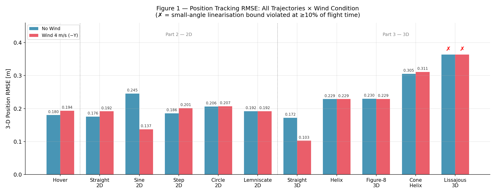
</p>

> **Figure 1** — 3D position RMSE across all 11 trajectory types, no-wind (blue) vs wind (red). ✗ marks indicate linearisation bound violated at ≥10% of flight time (Lissajous 3D only).

---

### 8.1 Part 1 — Hover

All metrics are evaluated over the FLYING phase only (after the 5 s pre-hover stabilisation period).

<table>
  <tr>
    <td>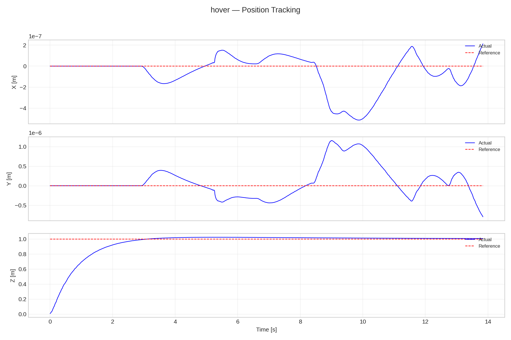</td>
    <td>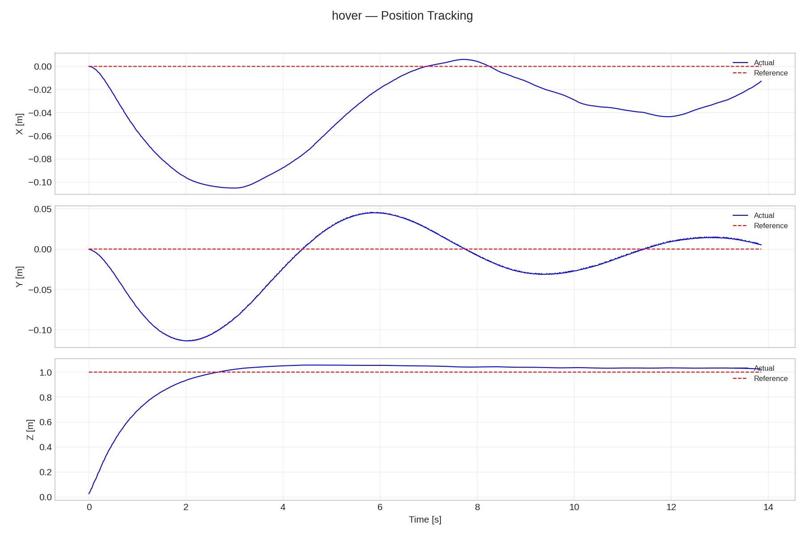</td>
  </tr>
  <tr>
    <td align="center"><em>Figure 2a — No Wind: SS error 9.3 mm</em></td>
    <td align="center"><em>Figure 2b — Wind 4 m/s (−y): SS error 48.2 mm, integral corrects y-drift</em></td>
  </tr>
</table>

| Metric | No Wind | Wind (4 m/s −y) |
|--------|---------|-----------------|
| Settling time (2% band) | **2.68 s** | 2.71 s |
| RMSE 3D [m] | 0.1803 | 0.1936 |
| SS error 3D [m] | **0.0093** | 0.0482 |
| Max $y$ deviation [m] | ≈ 0 | 0.114 (before integral settles) |
| Wind drift suppressed | — | **95.5%** (114 mm peak → 5 mm final) |
| Motor utilisation | 43.90% | 43.19% |

The integral action drives the residual y-offset from 114 mm (peak drift) down to 5 mm. The final integral accumulator value of 0.247 m·s is well within the ±2.0 m·s clamp. Under wind, rotors 0 & 3 spin faster to generate the roll bias countering the −y force — the physical signature of integral compensation.

---

### 8.2 Part 2 — 2D Trajectory Tracking

All trajectories fly in the x-z plane (`traj_plane=xz`). Reference yaw is fixed at $\psi_{\text{ref}} = 0$.

#### Representative: Sine Wave 2D

<table>
  <tr>
    <td>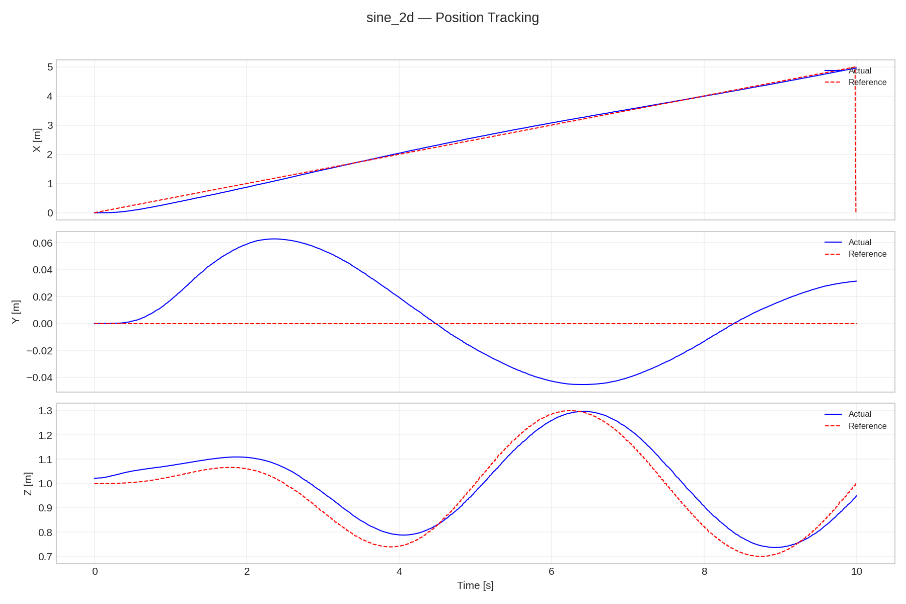</td>
    <td>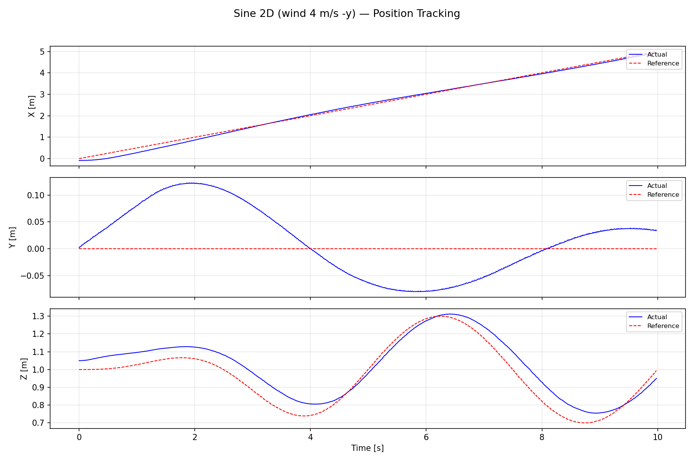</td>
  </tr>
  <tr>
    <td align="center"><em>Figure 3a — No Wind: x lag at sine z-peaks; RMSE 0.246 m</em></td>
    <td align="center"><em>Figure 3b — Wind: integral reduces RMSE to 0.137 m (counter-intuitive)</em></td>
  </tr>
</table>

> **Notable:** Sine wave RMSE is *lower* with wind (0.137 vs 0.246 m). The alternating $\pm x$ accelerations produce a zero-mean X error that the integrator partially cancels, while roll bias simultaneously compensates the $-y$ wind. This is coincidental, not by design.

#### Consolidated 2D Metrics

| Trajectory | Wind | RMSE 3D (m) | SS Err (m) | Max $\|\theta\|$ (°) |
|------------|------|:-----------:|:---------:|:-------------------:|
| Straight 2D | No | 0.1759 | 0.0558 | 3.47 |
| Straight 2D | Yes | 0.1916 | 0.0766 | 3.62 |
| Sine 2D | No | 0.2455 | 0.1115 | 6.17 |
| Sine 2D | Yes | **0.1372** | 0.0867 | 6.43 |
| Step 2D | No | 0.1856 | 0.0692 | 6.30 |
| Step 2D | Yes | 0.2011 | 0.0971 | 6.42 |
| Lemniscate 2D | No | 0.1922 | 0.2278 | 4.78 |
| Lemniscate 2D | Yes | 0.1922 | 0.2154 | 4.87 |
| Circle 2D | No | 0.2064 | 0.2598 | 5.03 |
| Circle 2D | Yes | 0.2069 | 0.2569 | 4.98 |

**Key observations:**
- **Straight line:** X-axis error dominates (0.171 m) because the constant-reference MPC cannot pre-compensate the trapezoidal ramp. Y-error doubles under wind (33 → 72 mm) but remains bounded.
- **Step (staircase):** Each altitude step recovers within **1.05 s** — the inherent closed-loop bandwidth. Wind does not degrade step response (same rise time), only adds y-drift.
- **Orbital trajectories (Lemniscate, Circle):** Elevated steady-state error (0.22–0.26 m) due to the constant-reference MPC formulation — the drone perpetually chases a reference ahead in phase. Wind has negligible RMSE impact (< 0.5%) because the orbit is symmetric in $y$.

---

### 8.3 Part 3 — 3D Trajectory Tracking

#### Representative: Helix Spiral

<table>
  <tr>
    <td>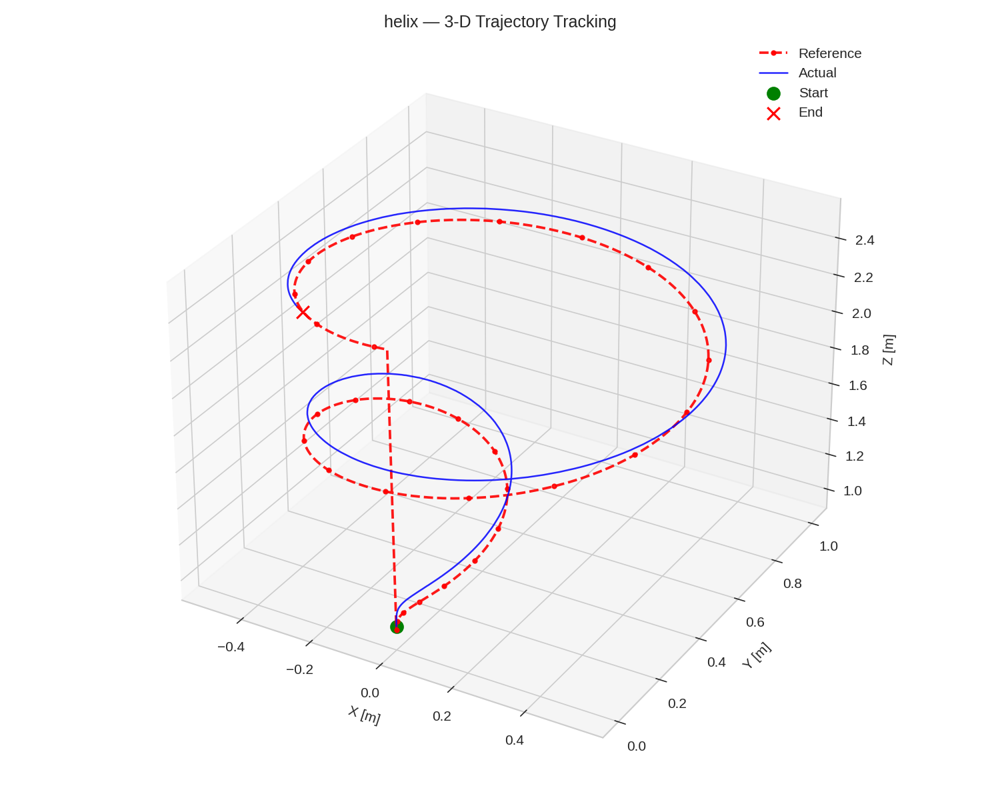</td>
    <td>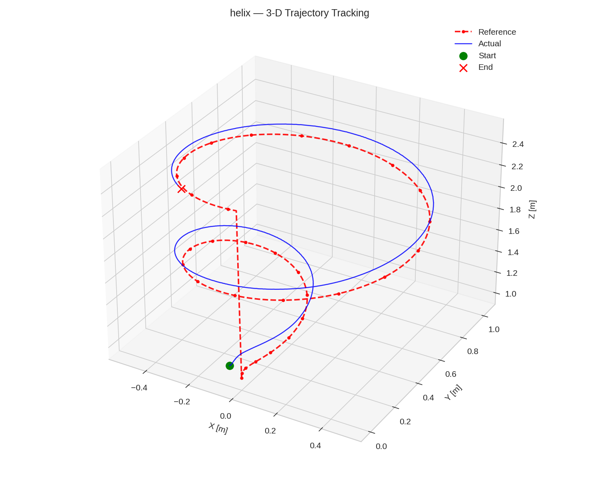</td>
  </tr>
  <tr>
    <td align="center"><em>Figure 4a — No Wind: clean helical climb; orbit lag symmetric</em></td>
    <td align="center"><em>Figure 4b — Wind: helix deforms slightly in y; z climb unaffected</em></td>
  </tr>
</table>

> The helix shows the **smallest wind sensitivity** of all 3D trajectories (RMSE difference 0.0001 m). The circular orbit visits all $y$-positions equally, so the integral compensates the wind bias within approximately one orbit period (5 s).

#### Case Study: Lissajous 3D — Linearisation Violation

<table>
  <tr>
    <td>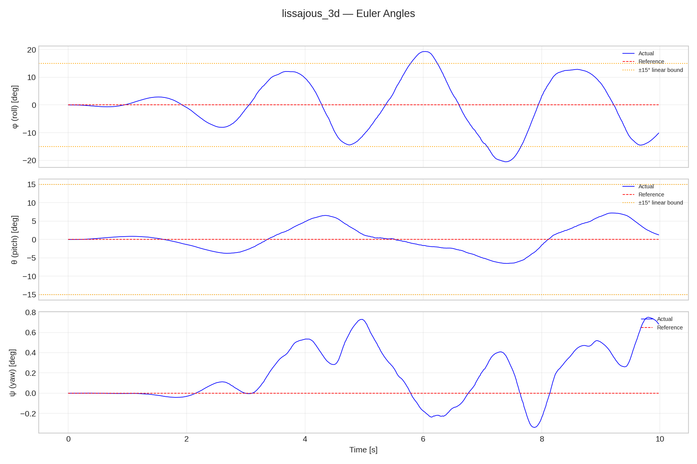</td>
    <td>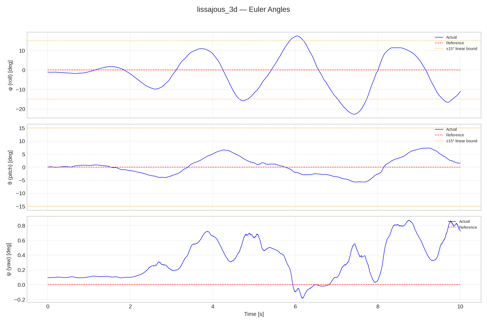</td>
  </tr>
  <tr>
    <td align="center"><em>Figure 5a — No Wind: roll reaches 20.5° — VIOLATES ±15° bound</em></td>
    <td align="center"><em>Figure 5b — Wind: roll reaches 22.7° — model further invalidated</em></td>
  </tr>
</table>

The $y(t) = R\sin(2\omega t)$ component at $2\omega = 2.51$ rad/s with $R = 0.5$ m produces peak lateral acceleration $|\ddot{y}| = R(2\omega)^2 \approx 3.16$ m/s², requiring $\phi \approx \arcsin(3.16/9.81) \approx 19°$. The measured maximum of **20.5°** exceeds both this prediction and the ±15° linearisation bound. Despite this, the controller degrades gracefully rather than diverging — the EKF's nonlinear prediction maintains accurate state estimates even at large angles.

#### Consolidated 3D Metrics

| Trajectory | Wind | RMSE 3D (m) | SS Err (m) | Max $\|\phi\|$ (°) | Max $\|\theta\|$ (°) | Lin. Valid |
|------------|------|:-----------:|:---------:|:------------------:|:--------------------:|:----------:|
| Straight 3D | No | 0.1723 | 0.0573 | 1.72 | 2.82 | ✓ |
| **Straight 3D** | **Yes** | **0.1026** | **0.0524** | 2.90 | 2.99 | ✓ |
| Helix | No | 0.2287 | 0.2836 | 4.80 | 5.26 | ✓ |
| Helix | Yes | 0.2286 | 0.2872 | 6.69 | 5.34 | ✓ |
| Figure-8 3D | No | 0.2298 | 0.2191 | 9.10 | 5.09 | ✓ |
| Figure-8 3D | Yes | 0.2289 | 0.2158 | 10.93 | 5.26 | ✓ |
| Cone Helix | No | 0.3051 | 0.4873 | 7.94 | 9.06 | ✓ |
| Cone Helix | Yes | 0.3110 | 0.4967 | 8.77 | 8.80 | ✓ |
| Lissajous 3D | No | 0.3638 | 0.3471 | 20.52 | 7.22 | **✗** |
| Lissajous 3D | Yes | 0.3633 | 0.3323 | 22.69 | 7.39 | **✗** |

**Key observations:**
- **Straight 3D with wind (RMSE 0.103 m)** is the best result across all experiments. The trajectory's $+y$ component partially opposes the $-y$ wind, accelerating integral convergence.
- **Cone helix** has the highest steady-state error (0.487 m) — a structural property of the monotonically growing radius, not a controller failure.
- **Lissajous 3D** is the only trajectory violating the ±15° bound. Its 35% RMSE degradation relative to Figure-8 (0.364 vs 0.230 m) quantifies the cost of model invalidation.

---

### 8.4 MPC Internal Metrics

<table>
  <tr>
    <td>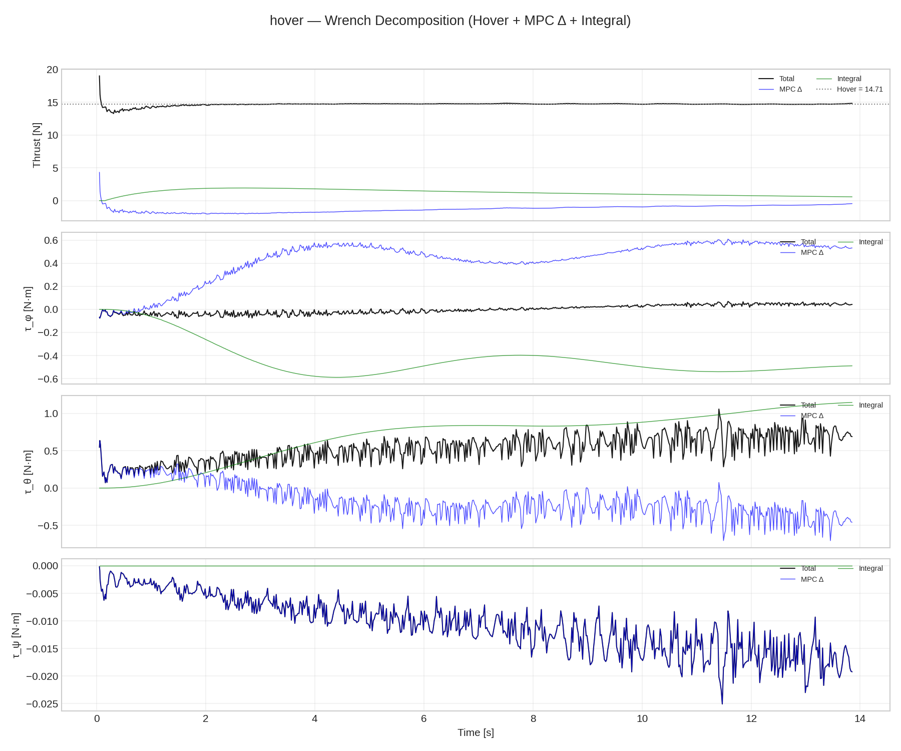</td>
    <td>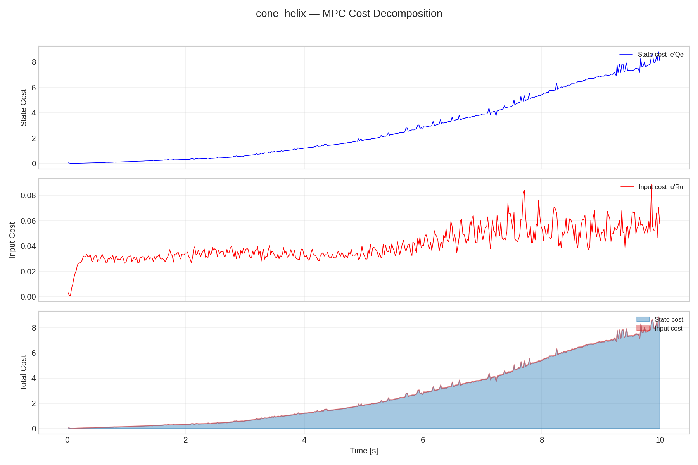</td>
  </tr>
  <tr>
    <td align="center"><em>Figure 6a — Hover wind: integral contribution grows as wind accumulates</em></td>
    <td align="center"><em>Figure 6b — Cone Helix: MPC cost rises with radius as orbit becomes harder</em></td>
  </tr>
</table>

All experiments achieved **100% MPC solve rate** and **zero torque-scale events** ($\lambda^* = 1.0$ always). Motor utilisation: 43.0–44.2% across all conditions, confirming 56% headroom for disturbance rejection.

<p align="center">
  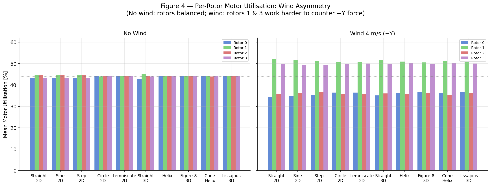
</p>

> **Figure 7** — Per-rotor utilisation. No-wind: all 4 rotors balanced at ~44%. Wind: rotors 0 & 3 spin faster (roll bias countering −y wind), rotors 1 & 2 partially unloaded.

---

## 9. Discussion and Analysis

### 9.1 Linearisation Validity

All experiments remain within the ±15° linearisation bound **except** Lissajous 3D (max roll 20.5°–22.7°). The boundary-approaching cases are Figure-8 3D (max roll 9.1°–10.9°) and Cone Helix (max pitch 9.1°), where the linearisation error $\sin\theta - \theta$ is approximately 0.4–1.3%.

The MPC cost decomposition provides a diagnostic: trajectories within the linearisation region show declining state cost after the initial transient (Straight 3D: $\bar{J}_x = 0.19$), while Cone Helix shows growing state cost as the orbital radius expands ($\bar{J}_x = 2.73$).

<p align="center">
  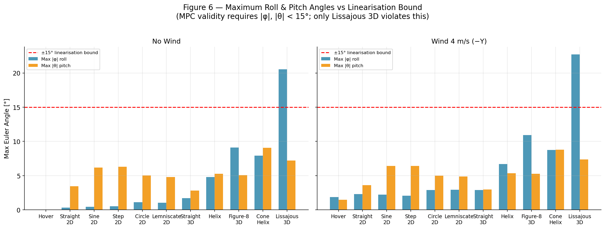
</p>

> **Figure 8** — Maximum roll and pitch across all trajectories vs the ±15° linearisation validity boundary (dashed red). All experiments except Lissajous 3D remain within the valid region.

### 9.2 Tracking Error Hierarchy

RMSE increases monotonically with trajectory complexity, driven by two distinct mechanisms:

| Trajectory class | Peak lateral $a$ [m/s²] | RMSE range [m] | Dominant error source |
|-----------------|------------------------|----------------|----------------------|
| Hover, Straight | 0.0–1.5 | 0.10–0.18 | EKF initialisation transient |
| Sine, Helix, Figure-8 | 1.5–2.0 | 0.19–0.23 | Phase lag (constant-reference MPC) |
| Cone, Lissajous | 2.0–3.2 | 0.30–0.36 | Linearisation model error |

The elevated **steady-state error for orbital trajectories** (0.22–0.49 m vs straight-line 0.05–0.08 m) is a formulation limitation: the constant-reference MPC horizon sees a fixed waypoint, not the upcoming curvature, producing systematic phase lag proportional to orbital speed.

<p align="center">
  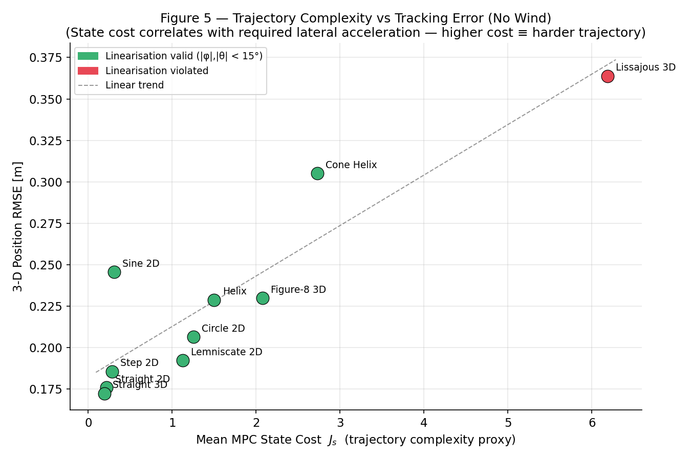
</p>

> **Figure 9** — Max roll angle vs RMSE. The strong positive correlation quantifies the linearisation-degradation mechanism. Lissajous 3D (✗) breaks the trend by operating beyond the valid model region.

### 9.3 Wind Disturbance Rejection

Without integral action, the proportional MPC cannot reject a constant aerodynamic offset — a constant wind force shifts the equilibrium point, and the finite-horizon optimisation cannot generate a non-zero corrective roll at steady state without incurring an input penalty for zero incremental benefit.

The integral action resolves this by accumulating the position offset and injecting a roll/pitch bias. Wind rejection effectiveness varies by trajectory type:
- **Symmetric orbits (Helix, Circle, Lemniscate):** Full rejection (RMSE wind sensitivity ≈ 0%) — the orbit visits equal $\pm y$ positions uniformly.
- **Straight-line trajectories:** Partial to full rejection (20–96%) depending on the $y$-component of flight direction.
- **Lissajous 3D (outside linearisation):** Partial rejection only — the linearisation error makes the integral correction itself model-inaccurate.

### 9.4 Limitations and Future Work

1. **Constant-reference horizon:** Providing the full N-step predicted reference trajectory (already computed by the trajectory generator) would eliminate the systematic phase lag on orbital trajectories — the single highest-impact improvement available.

2. **Linearisation domain:** A gain-scheduled MPC or iterative LQR (iLQR) approach would remove the ±15° restriction at the cost of increased computation.

3. **Integral anti-windup:** The integrator does not distinguish wind disturbance from tracking-lag error, causing small DC biases on orbital trajectories even without wind. A conditional integration scheme would eliminate this artefact.

4. **Horizon length:** The 20-step (0.4 s) horizon is adequate for speeds ≤ 0.5 m/s but insufficient for faster agile flight where trajectory curvature changes significantly within the horizon.

---

## 10. References

1. Coursera Robotics Specialization: Aerial Robotics — Prof. Vijay Kumar, University of Pennsylvania.
2. Lab material: [Formulation](./material/2C-1-Formulation.pdf) — Coordinate systems, motor model, rotation matrix, forces and moments.
3. Lab material: [Quadrotor Equations of Motion](./material/2C-4-Quadrotor-Equations-of-Motion.pdf) — Newton-Euler equations, 2D and 3D models.
4. Maciejowski, J. M. (2002). *Predictive Control with Constraints*. Prentice Hall.
5. Rawlings, J. B., Mayne, D. Q., & Diehl, M. (2017). *Model Predictive Control: Theory, Computation, and Design*. Nob Hill Publishing.
6. Welch, G., & Bishop, G. (1995). An Introduction to the Kalman Filter. UNC-Chapel Hill Technical Report TR 95-041.
